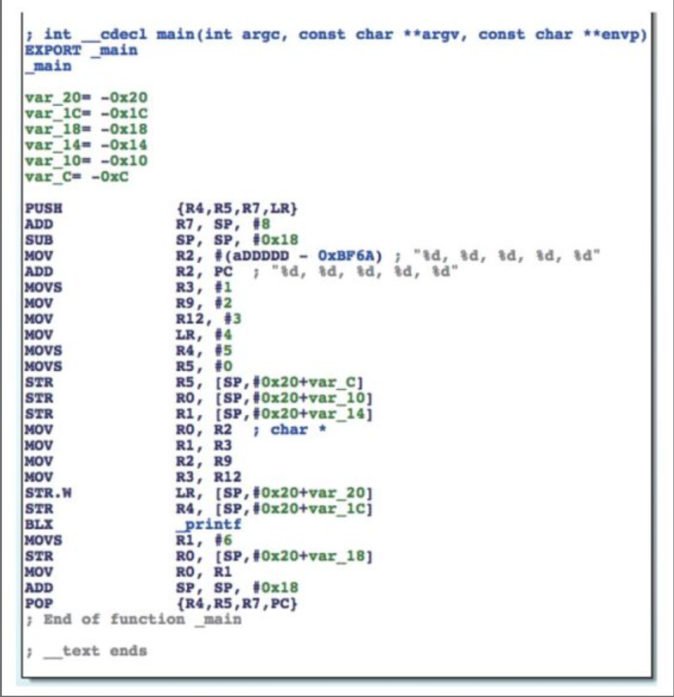

## 寄存器、内存和、栈
在高级语言里面，操作的是变量。在ARM汇编里面，操作的是寄存器（register）、内存和栈（stack）。

### 寄存器
`寄存器`可以看成CPU自带的变量，他们的数量一般是很有限的，当需要更多变量时，就可以把他们放在`内存`中；

### 栈
`栈`其实也是一片内存区域，但它具有内存的特点：先进后出。ARM的栈是`满递减（Full Descending）`的，`向下增长`，也就是`开口朝下`，新的变量被存放到栈底的位置；越靠近栈底，内存地址越小。
一个名为`stack pointer`（简称SP）的寄存器保存栈的栈底地址，称为栈地址；可以把一个变量给入（push）栈以保存它的值，也可以让它出（pop）栈，恢复变量的原始值。在实际操作中，栈地址会不断变化；但是在执行一块代码的前后，栈地址应该是不变的，不然程序就要出问题了。举个例子

```
static int global_var0;
static int global_var1;
…
void foo(void)
{
    bar();
    // 其他操作；
}
```

在上面4行代码中，假设函数foo()用到了A、B、C、D四个寄存器；foo()内部调用了bar()，假设bar()用到了A、B、C三个寄存器。因为2个不同的函数用到了3个相同的寄存器，所以bar()在开始执行前需要将3个寄存器中原来的值入栈以保存其原始值，在结束执行前将它们出栈以恢复其原始值，保证foo()能够正常执行。用伪汇编代码表示如下：

```
// foo()函数
foo:
    // 将A、B、C、D入栈，保存它们的原始值  
    入栈    {A, B, C, D}  
    // 使用A ~ D 
    移动    A, #1        // A = 1  
    移动    B, #2        // B = 2  
    移动    C, #3        // 你猜猜这行是什么意思？
    调用    bar   
    移动    D, global_var0      
    // global_var1 = A + B + C + D  
    相加    A, B         // A = A + B，注意此处A的值
    相加    A, C         // A = A + C，还要注意此处A的值
    相加    A, D         // 你再猜猜这行是什么意思？
    移动    global_var1, A
    // 将A、B、C、D出栈，恢复它们的原始值
    出栈    {A-D}   
    返回  
// bar()函数
bar:     
    // 将A、B、C入栈，保存它们的原始值A == 1，B == 2，C == 3
    入栈    {A-C}      
    // 使用A ~ C   
    移动     A, #2       // 还需要注释吗？
    移动     B, #5
    移动     C, A
    相加     C, B        // C = 7
    // global_var0 = A + B + C (== 2 * C)  
    相加     C, C
    移动     global_var0, C        // A = 2，B = 5，C = 14
    // 现在你知道入栈和出栈的重要意义了吗？
    出栈     {A-C} 
    返回
```

## 部分特殊用途的寄存器

> - R0-R3 传递参数与返回值
> - R7 帧指针，指向母函数与被调用子函数在栈中的交界
> - R9 在iOS 3.0以前被系统保留
> - R12 内部过程调用寄存器，dynamic linker会用到它
> - R13 SP寄存器
> - R14 LR寄存器，保存函数返回地址
> - R15 PC寄存器

## 分支跳转与条件判断
处理器中`PC`（program counter）的寄存器用于存放下一条指令的地址。
在ARM汇编中，分支的条件一般有4种：

* 操作结果为0或者不为0
* 操作结果为负数
* 操作结果有进位
* 运算溢出

这些条件的判断准则(flag)放在程序状态寄存器（PSR）中，`数据处理相关指令`会改变这些flag，`分支指令`再绝地是否跳转。

## ARM/THUMB指令解读
ARM处理器用到的指令集分为ARM和THUMB两种；ARM指令长度均为32bit，THUMB指令的长度均为16bit。所有指令可大致分为3大类，分别是`数据操作指令`、`内存操作指令`、`分支指令`

### 数据操作指令
数据操作指令有以下2条规则：
1） 所有操作数均为32bit;
2） 所有结果均为32bit，且只能放在寄存器中。

总的来说，数据操作指令的基本格式是：

```
op{cond}{s} Rd,Rn,Op2
```
其中`cond`和`s`是两个可选后缀；`cond`的作用是指定指令`op`在什么条件下执行，共有下面17种条件：

```
EQ              结果为0（EQual to 0）
NE              结果不为0（Not Equal to 0）
CS              有进位或借位（Carry Set）
HS              同CS（unsigned Higher or Same）
CC              没有进位或借位（Carry clear）
LO              同CC（unsigned LOwer）
MI              结果小于0（MInus）
PL              结果大于等于0（PLus）
VS              溢出（oVerflow Set）
VC              无溢出（oVerflow Clear）
HI              无符号比较大于（unsigned HIgher）
LS              无符号比较小于等于（unsigned Lower or Same）
GE              有符号比较大于等于（signed Greater than or Equal）
LT              有符号比较小于（signed Less Than）
GT              有符号比较大于（signed Greater Than）
LE              无符号比较小于等于（signed Less than or Equal）
AL              无条件（ALways，默认）
```
用法例子：

```
比较 R0, R1
移动 GE R2, R0
移动 LT R2, R1
```
比较R0和R1的值，如果R0大于等于R1，则R2=R0;否则R2=R1。

"s"的作用是指定指令"op"是否设置flag，共有下面4种flag：

```
N（Negative）
如果结果小于0则置1，否则置0；
Z（Zero）
如果结果是0则置1，否则置0；
C（Carry）
对于加操作（包括CMN）来说，如果产生进位则置1，否则置0；对于减操作（包括CMP）来说，Carry相当于Not-Borrow，如果产生借位则置0，否则置1；对于有移位操作的非加/减操作来说，C置移出值的最后一位；对于其他的非加/减操作来说，C的值一般不变；
V（oVerflow）
如果操作导致溢出，则置1，否则置0。
```
需要注意的一点，C flag表示无符号数运算结果是否溢出；V flag表示有符号数运算结果是否溢出。

数据操作指令可以大致分为以下4类：

#### 算术操作
```
ADD R0, R1, R2          ; R0 = R1 + R2
ADC R0, R1, R2          ; R0 = R1 + R2 + C(arry)
SUB R0, R1, R2          ; R0 = R1 - R2
SBC R0, R1, R2          ; R0 = R1 - R2 - !C
RSB R0, R1, R2          ; R0 = R2 - R1
RSC R0, R1, R2          ; R0 = R2 - R1 - !C
```
算术操作中，ADD和SUB为基础操作，其他均为两者的变种。RSB是“Reverse SuB”的缩写，仅仅是把SUB的两个操作数调换了位置而已；`以“C”（即Carry）结尾的变种代表有进位和借位的加减法，当产生进位或没有借位时，将Carry flag置1`。

#### 逻辑操作
```
AND R0, R1, R2          ; R0 = R1 & R2
ORR R0, R1, R2          ; R0 = R1 | R2
EOR R0, R1, R2          ; R0 = R1 ^ R2
BIC R0, R1, R2          ; R0 = R1 &~ R2
MOV R0, R2              ; R0 = R2
MVN R0, R2              ; R0 = ~R2
```
逻辑操作指令没什么多说的，它们的作用都已经用C操作符表示出来了，大家应该很熟悉；但是C操作符里的移位操作并没有对应的逻辑操作指令，因为ARM采用了桶式移位，共有以下4种指令：
```
LSL 逻辑左移 （右边补0）
LSR 逻辑右移 （左边补0）
ASR 算术右移 (左边最后一位是什么就补什么)
ROR 循环右移 （最右边的一位补到最左边的一位）
```

### 比较操作
```
CMP R1, R2  ;执行R1 - R2并依结果设置flag
CMN R1, R2  ;执行R1 + R2并依结果设置flag
TST R1, R2  ;执行R1 & R2并依结果设置flag
TEQ R1, R2  ;执行R1 ^ R2并依结果设置flag
```
比较操作其实就是改变flag的算术操作或逻辑操作,只是操作结果不保留在寄存器里而已。

### 乘法操作
```
MUL R4,R3,R2    ; R4 = R3*R2
MLA R4,R3,R2,R1     ; R4 = R3*R2+R1
```
乘法操作的操作数必须来自寄存器。

### 内存操作指令
内存操作指令的基本格式是：
    
```
op {cond}{type} Rd,[Rn,?Op2]
```
其中Rn是基址寄存器，用于存放基地址； "cond"的作用与数据操作指令相同；"type"指定指令"op"操作的数据类型,共有4种：

```
B（unsigned Byte）
无符号byte（执行时扩展到32bit，以0填充）；
SB（Signed Byte）
有符号byte（仅用于LDR指令；执行时扩展到32bit，以符号位填充）；
H（unsigned Halfword）
无符号halfword（执行时扩展到32bit，以0填充）；
SH（Signed Halfword）
有符号halfword（仅用于LDR指令；执行时扩展到32bit，以符号位填
充）。
```
如果不指定"type"，则默认数据类型是word。

ARM内存操作的基本指令只有两个：LDR （LoaD Register）将数据从内存中读出来，存到寄存器中；STR（Store Register）将数据从寄存器中读出来，存到内存中。两个指令的使用情况如下：

* LDR

```
LDR Rt, [Rn {, #offset}]        ; Rt = *(Rn {+ offset})，{}代表可选
LDR Rt, [Rn, #offset]!          ; Rt = *(Rn + offset); Rn = Rn + offset
LDR Rt, [Rn], #offset           ; Rt = *Rn; Rn = Rn + offset
```

* STR

```
STR Rt, [Rn {, #offset}]      ; *(Rn {+ offset}) = Rt
STR Rt, [Rn, #offset]!        ; *(Rn {+ offset}) = Rt; Rn = Rn + offset
STR Rt, [Rn], #offset         ; *Rn = Rt; Rn = Rn + offset
```

此外，LDR和SRT的变种LDRD和STRD还可以操作双字，即一次性操作2个寄存器，其基本格式如下：
```
op{cond} Rt,Rt2,[Rn{,#offset}]
```
其用法与原型类似，如下：

* STRD

```
STRD R4, R5,[R9,#offset]    ;*(R9 + offset) = R4; *(R9 + offset + 4) = R5
```

* LDSR

```
LDSR R4,R5,[R9,$offset]     ; R4 = *(R9 + offset); R5=*(R9+offset+4)
```
除了LDR和STR外，还可以通过`LDM（Load Mutiple）`和`STM （Store Mutiple）`进行块传输，一次性操作多个寄存器。块传输指令的基本格式是：

```
op{cond}{mode} Rd{!},reglist
```
其中Rd是基址寄存器，可选的"!"指定Rd变化后的值是否写回Rd； reglist是一系列寄存器，用大括号括起来，它们之间可以用“,”分隔，也可以用“-”表示一个范围，比如，**{R4–R6,R8}**表示寄存器R4、R5、R6、R8；这些寄存器的顺序是按照自身的编号由小到大排列的，与大括号内的排列顺序无关。

`需要特别注意的是`，LDM和STM的操作方向与LDR和STR完全相反：LDM是把从Rd开始，地址连续的内存数据存入reglist中，STM是把reglist中的值存入从Rd开始，地址连续的内存中。此处特别容易混淆，大家一定要注意！

“cond”的作用与数据操作指令相同。“mode”指定Rd值的4种变化规律，如下所示：

```
IA（Increment After）
每次传输后增加Rd的值；
IB（Increment Before）
每次传输前增加Rd的值；
DA（Decrement After）
每次传输后减少Rd的值；
DB（Decrement Before）
每次传输前减少Rd的值。
```

例如：
内存中存储着这些值。 `1，2，3，4，5，6，7，8` 。 R0指向5。执行以下指令得到的结果为

```
	 foo():
    LDMIA R0, {R4 – R6}                 ; R4 = 5, R5 = 6, R6 = 7
    LDMIB R0, {R4 – R6}                 ; R4 = 6, R5 = 7, R6 = 8
    LDMDA R0, {R4 – R6}                 ; R4 = 5, R5 = 4, R6 = 3
    LDMDB R0, {R4 – R6}                 ; R4 = 4, R5 = 3, R6 = 2”
```

### 分支指令
分支指令可以分为无条件和条件分支两种

* 无条件分支

```
B Label	;PC = Label
BL Label	;LR = PC - 4; PC = Label
BX Rd		;PC = Rd 并切换指令集
```
举个例子

```
foo():
	B Label	; 跳转到Label处往下执行
	....
Label:
	....
```

* 条件分支
条件分支的cond跟上面提到的4中flag来判断的

```
cond            flag
EQ              Z = 1
NE              Z = 0
CS              C = 1
HS              C = 1
CC              C = 0
LO              C = 0
MI              N = 1
PL              N = 0
VS              V = 1
VC              V = 0
HI              C = 1 & Z = 0
LS              C = 0 | Z = 1
GE              N = V
LT              N !=  V
GT              Z = 0 & N = V
LE              Z = 1 | N != V
```
在条件分支指令前会有一条数据操作指令来设置flag，分支指令根据flag的值来决定代码走向，举个例子：

```
Label:
    LDR R0, [R1], #4
    CMP R0, 0           ; 如果R0 == 0，Z = 1；否则Z = 0
    BNE　Label          ; Z ==　0则跳转
```


## ARM 调用规则
#### 1、前言与后记
当一个函数调用另外一个函数时，常常需要传递参数和返回值；如何传递这些数据，称为ARM汇编的调用规则。`在执行一块代码时，其前后栈地址应该是不变的`。这个操作是通过被执行代码块的前言（prologs）和后记（epilogs）完成的。前言所做的工作主要有：

* 将LR入栈；
* 将R7入栈；
* R7=SP;
* 将需要保留的寄存器原始值入栈；
* 为本地变量开辟空间；

后记工作：
后记所做的主要工作跟前言正好相反：

* 释放本地变量占用的空间；
* 将需要保留的寄存器原始值出栈；
* 将R7出栈；
* 将LR出栈，PC=LR。

前言和后记中的这些工作并不是必须的，如果这块代码压根儿就没有用到栈，就不需要"保留寄存器原始值"这一步了。


#### 2、传递参数与返回值
"函数的前4个参数存放在R0到R3中，其他参数存放在栈中；返回值放在R0中"


## 分析一个例子

```
// clang -arch armv7 -isysroot `xcrun --sdk iphoneos --show-
sdk-path` -o MainBinary main.m
#include <stdio.h>
int main(int argc, char **argv)
{
    printf("%d, %d, %d, %d, %d", 1, 2, 3, 4, 5);
    return 6;
}
```

上面的代码拉到IDA，展示出来的汇编代码是下面这样的



BLX\_printf”执行printf函数，它的6个参数分别存放在R0、R1、R2、R3、[SP,#0x20+var\_20]和[SP,#0x20+var\_1C]中，返回值存放在R0里，其中var\_20=-0x20，var\_1C=-0x1C，因此栈上的2个参数分别位于[SP]和[SP,#0x4]。