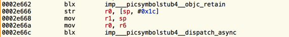
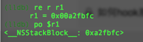
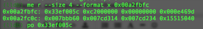
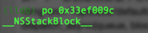
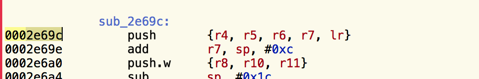

[block的实现](http://linlexus.com/implementation_of_block/)
 
[block的调试参考：]
(http://iosre.com/t/dispatch-async-queue-block-block/1234)

这几天一直在逆向某个APP，发现该APP很多监控数据都是通过某单例调用dispatch_async(queue, block)在block中同步到服务器上去的。以往某个带有block参数的函数在IDA或者hooper中都会相应地给出__function_invokeblock 这样的汇编代码块。但是在很多次跟dispatch_async这样的方法时，没有（及时）发现相对应的block代码块，搞的自己很郁闷，不知道应该怎么来下断点继续跟踪，于是决定今天研究一下这块的block对应的代码块怎么在内存中获取。
首先看了一下block的声明方式，参考文章[Block的实现]((http://linlexus.com/implementation_of_block/))。文章中说道Block可以理解为一个结构体(其实就是一个对象，也有isa指针)，结构体的简单表示为：

```
struct __main_block_impl_0 {  
  struct __block_impl impl;
  struct __main_block_desc_0* Desc;
};

struct __block_impl {  
  void *isa;
  int Flags;
  int Reserved;
  void *FuncPtr;
};

static struct __main_block_desc_0 {  
  size_t reserved;
  size_t Block_size;
};
```
其中我最关注的是 void *FuncPtr; 这个函数指针，因为他可以告诉我当dispatch_async(queue, block)执行之后，下一步的断点应该下在哪一行。看一下调用它的汇编代码吧



dispatch_async(queue, block) 中共有两个参数，第一个queue是r0, 第二个参数是r1，结果r1直接被赋值了一个sp的地址。断点停留在0x2e66c上的时候，查看了一下r1寄存器的情况，如图所示：



表明了r1是一个 NSStackBlock类型的对象（不知道这样描述是否正确），然后读取了一下0xa2fbfc这块的内存数据，如图：



根据上面说的block的结构，第一个数据应该为 block的 isa指针，po一下，如图：


然后依次推导，0xe469d就是block代码块的函数指针。于是从该位置下断点，发现确实程序从该处停下来了。
再次验证，0xe469d - 0xb6000(ASLR) = 0x2e69d 



正好也是函数开始的地方。这样整个dispatch_async(queue, block)中block的调用过程算是弄明白了，如何从dispatch_async切入，定位到第二个参数block的实现，也有章可循了。


## 修正：Block的结构体结构

```
struct Block_literal_1 {
    void *isa; // initialized to & _NSConcreteStackBlock or & _NSConcreteGlobalBlock
    int flags;
    int reserved;
    void (*invoke)(void *, ...);
    struct Block_descriptor_1 {
        unsigned long int reserved; // NULL
        unsigned long int size; // sizeof(struct Block_literal_1)
        // optional helper functions
        void (*copy_helper)(void *dst, void *src); // IFF (1 < < 25)
        void (*dispose_helper)(void *src); // IFF (1 << 25)
        // required ABI.2010.3.16
        const char *signature; // IFF (1 << 30)
    } *descriptor;
    // imported variables
};
```

重要的是记住第四个字段是函数指针。


# Block的使用注意点

ARC上有 weak strong dance可以很好的避免block的调用，野指针的问题。

但是MRC呢，MRC上没有weak。当对象被释放后，不能自动设置成nil。这样是很有可能导致block的野指针调用的。

参考：
<http://tanqisen.github.io/blog/2013/04/19/gcd-block-cycle-retain/>