# 什么是RunLoop

CFRunLoopRef 的代码是开源的，你可以在这里 <http://opensource.apple.com/tarballs/CF/> 下载到整个 CoreFoundation 的源码来查看。 <https://github.com/apple/swift-corelibs-foundation/> 这个是swift版的开源。

命令式执行

```
int main(int argc, char * argv[]){
	NSLog(@"hello world");
	return 0;
}
```

Event驱动

```
int main(int argc, char * argv[]){
	while(AppIsRunning){
		id whoWakesMe = SleepForWakingUp();
		id event = GetEvent(whoWakesMe);
		HandleEvent(event);
	}
	return 0;
}
```


## run Loop作用

RunLoop 实际上就是一个对象，这个对象管理了其需要处理的事件和消息，并提供了一个入口函数来执行上面 Event Loop 的逻辑。线程执行了这个函数后，就会一直处于这个函数内部 "接受消息->等待->处理" 的循环中，直到这个循环结束（比如传入 quit 的消息），函数返回。

* 使程序一直运行并接受用户输入
* 决定程序在何处应该处理哪些Event
* 调用解耦 (Message Queue)
* 节省CPU时间

## Run Loops、Cocoa、线程

层次架构

Foundation: NSRunLoop -> 就是对CF层的一个封装

Core Foundation: CFRunLoop -> 开源的，大概是3000行左右

System：GCD、mach kernel、block、pthread....


跟RunLoop关系比较大的一些

* NSTimer
* UIEvent
* AutoreleaseNSObject(NSDelayedPerforming)
* NSObject(NSThreadPerformAddition)
* CADisplayLink、CATransition（设置controller之间的转场动画）
* CAAnimation
* dispatch_get_main_queue()
* NSURLConnection
* AFNetworking


主线程几乎所有函数都是从以下六个之一的函数调起来

```
__CFRUNLOOP_IS_CALLING_OUT_TO_AN_OBSERVER_CALLBACK_FUNCTION__
__CFRUNLOOP_IS_CALLING_OUT_TO_A_SOURCE0_PERFORM_FUNCTION__
__CFRUNLOOP_IS_CALLING_OUT_TO_A_BLOCK__
__CFRUNLOOP_IS_CALLING_OUT_TO_A_TIMER_CALLBACK_FUNCTION__
__CFRUNLOOP_IS_CALLING_OUT_TO_A_SOURCE1_PERFORM_FUNCTION__
__CFRUNLOOP_IS_SERVICING_THE_MAIN_DISPATCH_QUEUE__
```


苹果不允许直接创建 RunLoop，它只提供了两个自动获取的函数：CFRunLoopGetMain() 和 CFRunLoopGetCurrent()。 线程和 RunLoop 之间是一一对应的，其关系是保存在一个全局的 Dictionary 里。线程刚创建时并没有 RunLoop，如果你不主动获取，那它一直都不会有。RunLoop 的创建是发生在第一次获取时，RunLoop 的销毁是发生在线程结束时。你只能在一个线程的内部获取其 RunLoop（主线程除外）。

# RunLoop 机制 

直接讲 Core Foundation层。

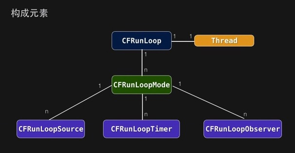

CFRunLoopMode是个非常重要的概念， 起决定性的作用就是下面的三个。CFRunloopSource、CFRunLoopTimer、CFRunLoopObserver。   runloop可以嵌套，要么就同时只有一个mode在跑。

一个 RunLoop 包含若干个 Mode，每个 Mode 又包含若干个 Source/Timer/Observer。每次调用 RunLoop 的主函数时，只能指定其中一个 Mode，这个Mode被称作 CurrentMode。如果需要切换 Mode，只能退出 Loop，再重新指定一个 Mode 进入。这样做主要是为了分隔开不同组的 Source/Timer/Observer，让其互不影响。 

 Source/Timer/Observer 被统称为 mode item，**一个 item 可以被同时加入多个 mode。但一个 item 被重复加入同一个 mode 时是不会有效果的。如果一个 mode 中一个 item 都没有，则 RunLoop 会直接退出，不进入循环。**

## RunLoop Mode
RunLoop在同一段时间只能且必须在一种特定Mode下Run,更换Mode时,需要停止当前Loop,然后重启新Loop,Mode是iOS App滑动顺畅的关键 。（滑动的时候，会切掉mode，只跑滑动的mode）

* NSDefaultRunLoopMode  默认状态、空闲状态
* UITrackingRunLoopMode 滑动ScrollView时的mode
* UIInitializationRunLoopMode 私有，App启动时
* NSRunLoopCommonModes Mode集合

**NSRunLoopCommonModes**：一个 Mode 可以将自己标记为"Common"属性（通过将其 ModeName 添加到 RunLoop 的 "commonModes" 中）。每当 RunLoop 的内容发生变化时，RunLoop 都会自动将 _commonModeItems 里的 Source/Observer/Timer 同步到具有 "Common" 标记的所有Mode里。

**应用场景举例：** 主线程的 RunLoop 里有两个预置的 Mode：kCFRunLoopDefaultMode 和 UITrackingRunLoopMode。这两个 Mode 都已经被标记为"Common"属性。DefaultMode 是 App 平时所处的状态，TrackingRunLoopMode 是追踪 ScrollView 滑动时的状态。当你创建一个 Timer 并加到 DefaultMode 时，Timer 会得到重复回调，但此时滑动一个TableView时，RunLoop 会将 mode 切换为 TrackingRunLoopMode，这时 Timer 就不会被回调，并且也不会影响到滑动操作。 如果希望在滑动的时候，也能调用到timer的回调，则只要把Timer加到NSRunLoopCommonModes，这样在滑动的时候也能调用到timer回调。

**CFRunLoop对外暴露的管理 Mode 接口只有下面2个:**

```
CFRunLoopAddCommonMode(CFRunLoopRef runloop, CFStringRef modeName);
CFRunLoopRunInMode(CFStringRef modeName, ...);
```

**Mode 暴露的管理 mode item 的接口有下面几个**

```
CFRunLoopAddSource(CFRunLoopRef rl, CFRunLoopSourceRef source, CFStringRef modeName);
CFRunLoopAddObserver(CFRunLoopRef rl, CFRunLoopObserverRef observer, CFStringRef modeName);
CFRunLoopAddTimer(CFRunLoopRef rl, CFRunLoopTimerRef timer, CFStringRef mode);
CFRunLoopRemoveSource(CFRunLoopRef rl, CFRunLoopSourceRef source, CFStringRef modeName);
CFRunLoopRemoveObserver(CFRunLoopRef rl, CFRunLoopObserverRef observer, CFStringRef modeName);
CFRunLoopRemoveTimer(CFRunLoopRef rl, CFRunLoopTimerRef timer, CFStringRef mode);
```

苹果公开提供的 Mode 有两个：kCFRunLoopDefaultMode (NSDefaultRunLoopMode) 和 UITrackingRunLoopMode，你可以用这两个 Mode Name 来操作其对应的 Mode。

同时苹果还提供了一个操作 Common 标记的字符串：kCFRunLoopCommonModes (NSRunLoopCommonModes)，你可以用这个字符串来操作 Common Items，或标记一个 Mode 为 "Common"。使用时注意区分这个字符串和其他 mode name。

## RunLoop mode item
### CFRunLoopTimer

它和 NSTimer 是toll-free bridged 的，可以混用。其包含一个时间长度和一个回调（函数指针）。当其加入到 RunLoop 时，RunLoop会注册对应的时间点，当时间点到时，RunLoop会被唤醒以执行那个回调。

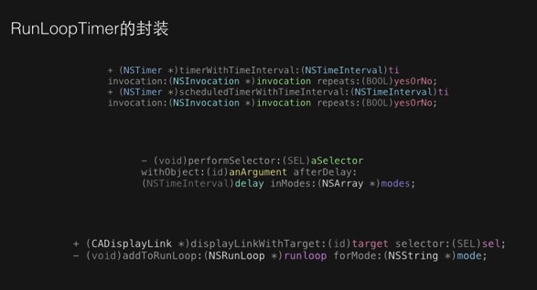

### CFRunLoopSource
Source是RunLoop的数据源抽象类， RunLoop定义了两个Version的Source:

```
->1、Source0: 
处理App内部时间、App自己负责管理（触发），如UIEvent、CFSocket

Source0 只包含了一个回调（函数指针，下图中的（void)(* perform）(void *info)，它并不能主动触发事件。使用时，你需要先调用 CFRunLoopSourceSignal(source)，将这个 Source 标记为待处理，然后手动调用 


->2、Source1: 
由Runloop和内核管理,Mach port驱动，如CFMackPort、CFMessagePort

Source1 包含了一个 mach_port 和一个回调（函数指针），被用于通过内核和其他线程相互发送消息。这种 Source 能主动唤醒 RunLoop 的线程

```

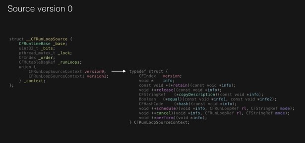


### CFRunLoopObserver

是观察者，每个 Observer 都包含了一个回调（函数指针），当 RunLoop 的状态发生变化时，观察者就能通过回调接受到这个变化。可以观测的时间点有以下几个：

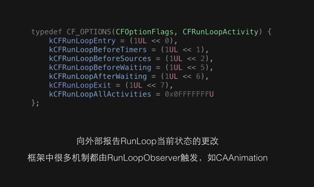

函数是**CFRunLoopObserverCreateWithHandler**

CAAnimation应该是在beforWaiting或者afterWaiting后才调用，而不是调用了后就立即调用。会先收集一些animation的动作后，再一起执行。

## RunLoop的挂起与唤醒

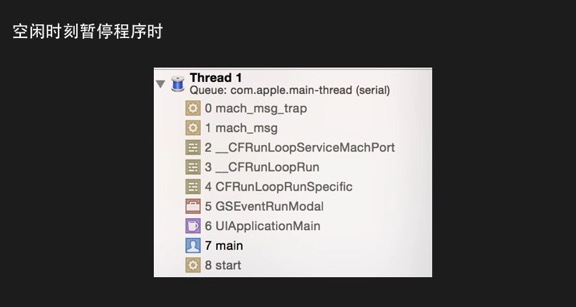

mach\_msg\_trap、mach\_msg 是mac 内核的东西.__CFRunLoopServiceMachPort 发送一个消息,代表等待别人唤起的状态，这个runloop就被挂起。

* 指定用于唤醒的mach_port端口
* 调用mach\_msg监听唤醒端口，被唤醒前，系统内核将这个线程挂起，停留在mach\_msg\_trap状态
* 由另一个线程 （或另一个进程中的某个线程）向内核发送这个端口的msg后，trap状态被唤醒，RunLoop继续开始干活。

## RunLoop迭代执行顺序

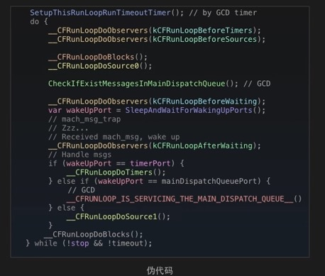

确切说是主线程上的RunLoop的执行顺序。

## RunLoopObserver 与 Autorelease Pool
Observer被触发的时候，调用的 Autorelease。  UIKit通过RunLoopObserver在RunLoop两次Sleep间对AutoreleasePool进行Pod和Push。将这次Loop中产生的Autorelease对象释放。 

子线程中的自动释放池的释放：每个线程创建的时候就会创建一个autorelease pool，并且在线程退出的时候，清空autorelease pool。所以子线程的autorelease对象，要么在子线程中设置runloop清楚

[Autorelease原理](http://blog.sunnyxx.com/2014/10/15/behind-autorelease/) 关键点：一个以 AutoreleasePoolPage为节点的双向链表, 每个page是4096（虚拟内存一页的大小）。除了一些必要的字段占用的空间。剩下的空间用于存放需要释放的对象指针。放满了后再直线下一个链表

## CFRunLoopMode
RunLoop在同一段时间只能且必须在一种特定Mode下Run,更换Mode时,需要停止当前Loop,然后重启新Loop,Mode是iOS App滑动顺畅的关键 。（滑动的时候，会切掉mode，只跑滑动的mode）

* NSDefaultRunLoopMode  默认状态、空闲状态
* UITrackingRunLoopMode 滑动ScrollView时的mode
* UIInitializationRunLoopMode 私有，App启动时
* NSRunLoopCommonModes Mode集合


## UITrackingRunLoopMode 与 Timer
timer跑在 NSDefaultRunLoopMode 的话，滑动ScrollView，会被暂停。

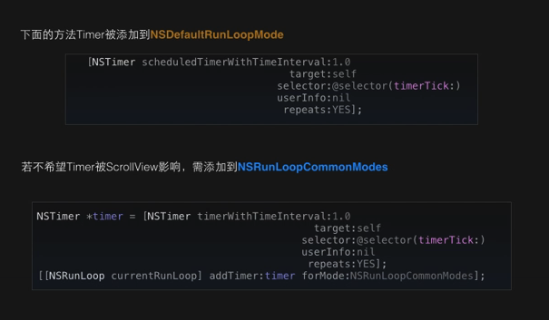

注意：子线程默认是没有创建runloop的，除非调用了Runloop相关的接口，才会生成。  

有时你需要一个 Timer，在两个 Mode 中都能得到回调，一种办法就是将这个 Timer 分别加入这两个 Mode。还有一种方式，就是将 Timer 加入到顶层的 RunLoop 的 "commonModeItems" 中。"commonModeItems" 被 RunLoop 自动更新到所有具有"Common"属性的 Mode 里去。

## RunLoopMode的切换

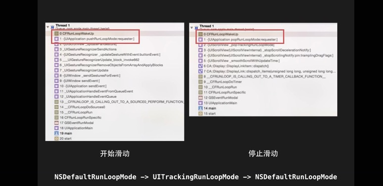

可以看出在滑动的时候是运行在UITrackingRunLoopMode下的，这个时候是在跑 timer。


## RunLoop 与 dispatch\_get\_main\_queue()

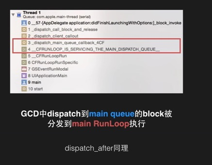

queue如果是main queue的话，GCD就和runloop有关系。主要是因为大家获取的主线程是一样的。这里的关系，也就仅仅是用于runloop调起main queue的block。


## RunLoop的挂起与唤醒


mach\_msg\_trap、mach\_msg 是mac 内核的东西.__CFRunLoopServiceMachPort 发送一个消息,代表等待别人唤起的状态，这个runloop就被挂起。

* 指定用于唤醒的mach_port端口
* 调用mach\_msg监听唤醒端口，被唤醒前，系统内核将这个线程挂起，停留在mach\_msg\_trap状态
* 由另一个线程 （或另一个进程中的某个线程）向内核发送这个端口的msg后，trap状态被唤醒，RunLoop继续开始干活。

## RunLoop迭代执行顺序


确切说是主线程上的RunLoop的执行顺序。


# 实践
`[runloop addPort:[NSMachPort port] forMode:NSDefaultRunLoopMode]` 用于别让线程被销毁，一直等待这这个port。

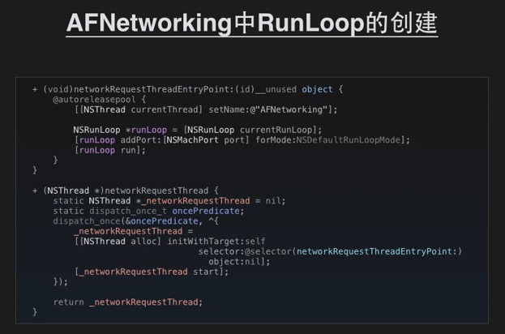

加载图片的时候避免在滑动的模式下加载，以免卡住滑动。闲时再加载

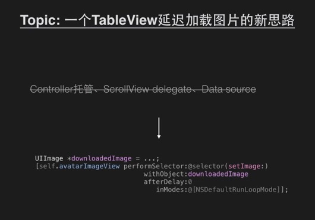


## 网络请求
通常使用 NSURLConnection 时，你会传入一个 Delegate，当调用了 [connection start] 后，这个 Delegate 就会不停收到事件回调。实际上，start 这个函数的内部会会获取 CurrentRunLoop，然后在其中的 DefaultMode 添加了4个 Source0 (即需要手动触发的Source)。CFMultiplexerSource 是负责各种 Delegate 回调的，CFHTTPCookieStorage 是处理各种 Cookie 的。

当开始网络传输时，我们可以看到 NSURLConnection 创建了两个新线程：com.apple.NSURLConnectionLoader 和 com.apple.CFSocket.private。其中 CFSocket 线程是处理底层 socket 连接的。NSURLConnectionLoader 这个线程内部会使用 RunLoop 来接收底层 socket 的事件，并通过之前添加的 Source0 通知到上层的 Delegate。

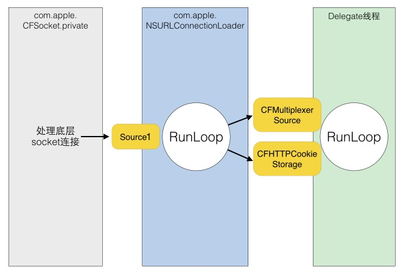

NSURLConnectionLoader 中的 RunLoop 通过一些基于 mach port 的 Source 接收来自底层 CFSocket 的通知。当收到通知后，其会在合适的时机向 CFMultiplexerSource 等 Source0 发送通知，同时唤醒 Delegate 线程的 RunLoop 来让其处理这些通知。CFMultiplexerSource 会在 Delegate 线程的 RunLoop 对 Delegate 执行实际的回调。

## 在AFNetWorking中应用
[runloop addPort:[NSMachPort port] forMode:NSDefaultRunLoopMode]用于别让线程被销毁，一直等待这这个port。

AFURLConnectionOperation 这个类是基于 NSURLConnection 构建的，其希望能在后台线程接收 Delegate 回调。为此 AFNetworking 单独创建了一个线程，并在这个线程中启动了一个 RunLoop：


RunLoop 启动前内部必须要有至少一个 Timer/Observer/Source，所以 AFNetworking 在 [runLoop run] 之前先创建了一个新的 NSMachPort 添加进去了。通常情况下，调用者需要持有这个 NSMachPort (mach_port) 并在外部线程通过这个 port 发送消息到 loop 内；但此处添加 port 只是为了让 RunLoop 不至于退出，并没有用于实际的发送消息。

```
- (void)start {
    [self.lock lock];
    if ([self isCancelled]) {
        [self performSelector:@selector(cancelConnection) onThread:[[self class] networkRequestThread] withObject:nil waitUntilDone:NO modes:[self.runLoopModes allObjects]];
    } else if ([self isReady]) {
        self.state = AFOperationExecutingState;
        [self performSelector:@selector(operationDidStart) onThread:[[self class] networkRequestThread] withObject:nil waitUntilDone:NO modes:[self.runLoopModes allObjects]];
    }
    [self.lock unlock];
}
```

当需要这个后台线程执行任务时，AFNetworking 通过调用 [NSObject performSelector:onThread:..] 将这个任务扔到了后台线程的 RunLoop 中。

## Async Test Case
facebook的开源库，可以在后台进程异步创建 UIView、CALayer。在内部封装了 UIView/CALayer，它具有和 UIView/CALayer 相似的属性，例如 frame、backgroundColor等。所有这些属性都可以在后台线程更改，开发者可以只通过 Node 来操作其内部的 UIView/CALayer，这样就可以将排版和绘制放入了后台线程。但是无论怎么操作，这些属性总需要在某个时刻同步到主线程的 UIView/CALayer 去。

<https://github.com/facebook/AsyncDisplayKit>

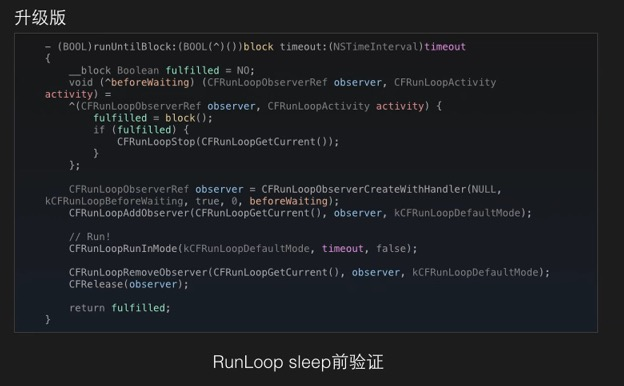


# 参考
[iOS线下分享 孙源]()

深入理解RunLoop <http://blog.ibireme.com/2015/05/18/runloop/>

进程间通信，Mach ports <https://segmentfault.com/a/1190000002400329>


