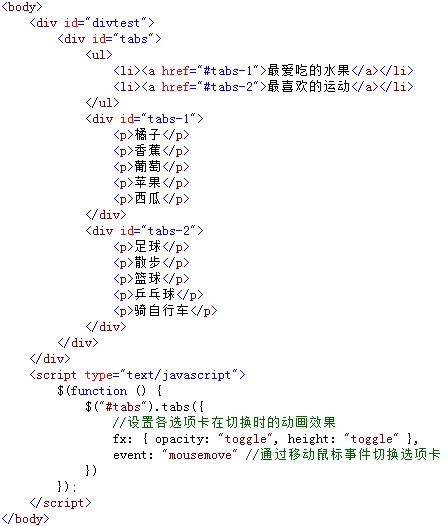
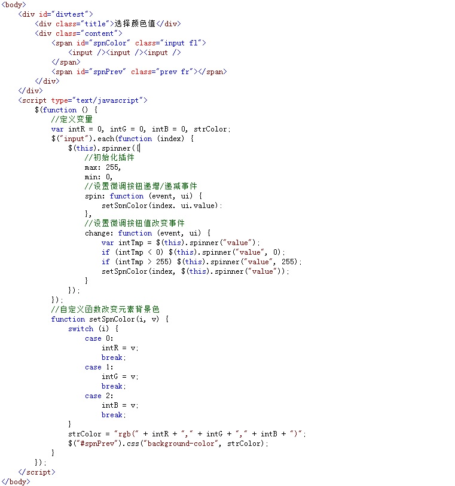
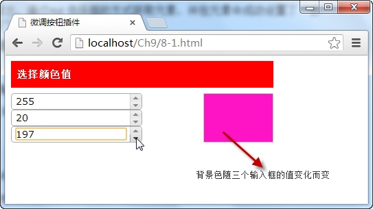

# 常用插件

## 表单验证插件——validate
该插件自带包含必填、数字、URL在内容的验证规则，即时显示异常信息，此外，还允许自定义验证规则，插件调用方法如下：

`$(form).validate({options})`

其中form参数表示表单元素名称，options参数表示调用方法时的配置对象，所有的验证规则和异常信息显示的位置都在该对象中进行设置。

例如，当点击表单中的“提交”按钮时，调用validate插件验证用户名输入是否符合规则，并将异常信息显示在页面中，如下图所示：


在浏览器中显示的效果：


从图中可以看出，在页面中导入了validate插件，当用户在输入框中录入用户名时，自动根据规则进入验证，并显示提示信息，验证成功后，表单才能提交。

## 表单插件——form
通过表单form插件，调用ajaxForm()方法，实现ajax方式向服务器提交表单数据，并通过方法中的options对象获取服务器返回数据，调用格式如下：

`$(form). ajaxForm ({options})`

其中form参数表示表单元素名称；options是一个配置对象，用于在发送ajax请求过程，设置发送时的数据和参数。

例如，在页面中点击“提交”按钮，调用form插件的
ajaxForm()方法向服务器发送录入的用户名和密码数据，服务器接收后返回并显示在页面中，如下图所示：


在浏览器中显示的效果：


从图中可以看出，当点击“提交”按钮时，调用form表单插件中的ajaxForm()方法向指定的服务器以ajax方式发送数据，服务器接收后返回并将数据显示。

## 图片灯箱插件——lightBox
该插件可以用圆角的方式展示选择中的图片，使用按钮查看上下张图片，在加载图片时自带进度条，还能以自动播放的方式浏览图片，调用格式如下：

`$(linkimage).lightBox({options})`

其中linkimage参数为包含图片的`<a>`元素名称，options为插件方法的配置对象。

例如，以列表的方式在页面中展示全部的图片，当用户单击其中某张图片时，通过引入的图片插件，采用“灯箱”的方式显示所选的图片，如下图所示：


在浏览器中显示的效果：


从图中可以看出，当用户点击“我的相册”中某一张图片时，则采用“灯箱”的方式显示选中图片，在显示图片时，还可以切换上下张和自动播放及关闭图片。


## 图片放大镜插件——jqzoom
在调用jqzoom图片放大镜插件时，需要准备一大一小两张一样的图片，在页面中显示小图片，当鼠标在小图片中移动时，调用该插件的jqzoom()方法，显示与小图片相同的大图片区域，从而实现放大镜的效果，调用格式如下：

`$(linkimage).jqzoom({options})`

其中linkimage参数为包含图片的`<a>`元素名称，options为插件方法的配置对象。

```
    <body>
        <div id="divtest">
            <div class="title">
                <span class="fl">图片放大镜</span> 
            </div>
            <div class="content">
                <a href="http://img.mukewang.com/52e4aec90001924d06800599.jpg" id="jqzoom" title="小兔子乖乖">
        	         
                </a>
            </div>
        </div>
        
        <script type="text/javascript">
            $(function () {
                $(".content").jqzoom({ //绑定图片放大插件jqzoom
                    zoomWidth: 123, //小图片所选区域的宽
                    zoomHeight: 123, //小图片所选区域的高
                    zoomType: 'reverse' //设置放大镜的类型
                });
            });
        </script>
    </body>
```

点击图片后，加载大的图片

## cookie插件——cookie
使用cookie插件后，可以很方便地通过cookie对象保存、读取、删除用户的信息，还能通过cookie插件保存用户的浏览记录，它的调用格式为：

保存：`$.cookie(key，value)；`读取：`$.cookie(key)`，删除：`$.cookie(key，null)`

其中参数key为保存cookie对象的名称，value为名称对应的cookie值。

例如，当点击“设置”按钮时，如果是“否保存用户名”的复选框为选中状态时，则使用cookie对象保存用户名，否则，删除保存的cookie用户名，如下图所示：


在浏览器中显示的效果：


从图中可以看出，由于在点击“设置”按钮时，选择了保存用户名，因此，输入框中的值被cookie保存，下次打开浏览器时，直接获取并显示保存的cookie值。


## 搜索插件——autocomplete
搜索插件的功能是通过插件的autocomplete()方法与文本框相绑定，当文本框输入字符时，绑定后的插件将返回与字符相近的字符串提示选择，调用格式如下：

`$(textbox).autocomplete(urlData,[options]);`

其中，textbox参数为文本框元素名称，urlData为插件返回的相近字符串数据，可选项参数options为调用插件方法时的配置对象。

例如，当用户在文本框输入内容时，调用搜索插件的autocomplete()方法返回与输入内容相匹配的字符串数据，显示在文本框下，提示选择，如下图所示：


在浏览器中显示的效果：


从图中可以看出，当文本框与搜索插件相绑定后，输入任意字符时，都将返回与之相匹配的字符串，提示用户选择，文本框在空白双击时，显示全部提示信息。


## 右键菜单插件——contextmenu
右键菜单插件可以绑定页面中的任意元素，绑定后，选中元素，点击右键，便通过该插件弹出一个快捷菜单，点击菜单各项名称执行相应操作，调用代码如下：

`$(selector).contextMenu(menuId,{options});`

Selector参数为绑定插件的元素，meunId为快捷菜单元素，options为配置对象。

例如，选中页面`<textarea>`元素，点击右键，弹出插件绑定的快捷菜单，点击菜单中的各个选项，便在页面中显示操作的对应名称。如下图所示：


在浏览器中显示的效果：


从图中可以看出，当文本框与右键菜单通过插件contextmenu()方法绑定后，选中文本框，点击右键时，弹出快捷菜单，点击“新建”选项时，显示操作对应内容。


## 自定义对象级插件——lifocuscolor插件
定义的lifocuscolor插件可以在`<ul>`元素中，鼠标在表项`<li>`元素移动时，自定义其获取焦点时的背景色，即定义`<li>`元素选中时的背景色，调用格式为：

`$(Id).focusColor(color)`

其中，参数Id表示`<ul>`元素的Id号，color表示`<li>`元素选中时的背景色。

例如：

```
    <body>
        <div id="divtest">
            <div class="title">
                <span class="fl">对象级别的插件</span>
            </div>
            <div class="content">
                <ul id="u1">
                    <li><span>橘子</span><span>水果</span></li>
                    <li><span>芹菜</span><span>蔬菜</span></li>
                    <li><span>香蕉</span><span>水果</span></li>
                </ul>
            </div>
        </div>
        
        <script type="text/javascript">
            $(function () {
                $("#u1").focusColor("#ccc"); //调用自定义的插件
            })
        </script>
    </body>
```

## 自定义类级别插件—— twoaddresult
通过调用自定义插件twoaddresult中的不同方法，可以实现对两个数值进行相加和相减的运算，导入插件后，调用格式分别为：

`$.addNum(p1,p2) 和 $.subNum(p1,p2)`

上述调用格式分别为计算两数值相加和相减的结果，p1和p2为任意数值。

# UI型插件
## 拖曳插件——draggable
拖曳插件draggable的功能是拖动被绑定的元素，当这个jQuery UI插件与元素绑定后，可以通过调用draggable()方法，实现各种拖曳元素的效果，调用格式如下：

`$(selector). draggable({options})`

options参数为方法调用时的配置对象，根据该对象可以设置各种拖曳效果，如“containment”属性指定拖曳区域，“axis”属性设置拖曳时的坐标方向。

例子： 

```
    <body>
        <div id="divtest">
            <div id="x" class="drag">沿x轴拖拽</div>
            <div id="y" class="drag">沿y轴拖拽</div>
        </div>
        
        <script type="text/javascript">
            $(function () {
                $("#x").draggable({ containment: "parent", axis:"x" });
                $("#y").draggable({ containment: "parent", axis:"y" });
            });
        </script>
    </body>
```

## 放置插件——droppable
除使用draggable插件拖曳任意元素外，还可以调用droppable UI插件将拖曳后的任意元素放置在指定区域中，类似购物车效果，调用格式如下：

`$(selector).droppable({options})`

selector参数为接收拖曳元素，options为方法的配置对象，在对象中，drop函数表示当被接收的拖曳元素完全进入接收元素的容器时，触发该函数的调用。

例子：

```
    <body>
        <div id="divtest">
            <div class="box">
                <div class="title">产品区</div>
                <div class="drag"><div>苹果</div></div>
            </div>
            <div class="box">
                <div class="title">回收站</div>
                <div class="cart"><div id="tip">还没有产品</div></div>
            </div>
        </div>
        
        <script type="text/javascript">
            var intSum = 0;
            $(function () {
                $(".drag").draggable();
                $(".cart").droppable({
                    drop: function () {
                        intSum++;
                        $(this)
                        .addClass("focus") // 改变购物车的css
                        .find("#tip").html("");//删除原有内容
                        $(".cart div").html(intSum);    
                    }
                })
            });
        </script>
    </body>
```


## 拖曳排序插件——sortable
拖曳排序插件的功能是将序列元素（例如`<option>、<li>`）按任意位置进行拖曳从而形成一个新的元素序列，实现拖曳排序的功能，它的调用格式为：

`$(selector).sortable({options});`

selector参数为进行拖曳排序的元素，options为调用方法时的配置对象，

例如，在页面中，通过加载sortable插件将`<ul>`元素中的各个`<li>`表项实现拖曳排序的功能，如下图所示：


在浏览器中显示的效果：


从图中可以看出，由于使用sortable插件绑定了`<ul>`元素，并设置了拖曳时的透明度，因此，`<ul>`中的各个`<li>`元素则能指定的透明度进行任意的拖曳排序。


## 面板折叠插件-accordion
面板折叠插件可以实现页面中指定区域类似“手风琴”的折叠效果，即点击标题时展开内容，再点另一标题时，关闭已展开的内容，调用格式如下：

`$(selector).accordion({options});`

其中，参数selector为整个面板元素，options参数为方法对应的配置对象。

例如，通过accordion插件展示几个相同区域面板的折叠效果，如下图所示：


在浏览器中显示的效果：


从图中可以看出，由于绑定了折叠面板插件，默认为第一个面板的内容为展示状态，点击第二个面板主题时，展示主题对应内容，同时关闭上一个面板内容。


## 选项卡插件——tabs

使用选项卡插件可以将`<ul>`中的`<li>`选项定义为选项标题，在标题中，再使用<a>元素的“href”属性设置选项标题对应的内容，它的调用格式如下：

`$(selector).tabs({options});`

selector参数为选项卡整体外围元素，该元素包含选项卡标题与内容，options参数为tabs()方法的配置对象，通过该对象还能以ajax方式加载选项卡的内容。

例如，在页面中，添加选项卡的标题和内容元素，并绑定tabs插件，当点击标题时，以选项卡的方式切内容，如下图所示：



在浏览器中显示的效果：


从图中可以看出，在tabs()方法的配置对象中，通过“fx”属性设置了选项卡切换时的效果，“event”属性设置鼠标也可以切换选项卡，因此，当鼠标在移动至两个选项卡标题时，对应内容以动画的效果自动切换。

## 对话框插件——dialog
对话框插件可以用动画的效果弹出多种类型的对话框，实现JavaScript代码中alert()和confirm()函数的功能，它的调用格式为：

`$(selector).dialog({options});`

selector参数为显示弹出对话框的元素，通常为`<div>`，options参数为方法的配置对象，在对象中可以设置对话框类型、“确定”、“取消”按钮执行的代码等。


```
    <body>
        <div id="divtest">
            <div class="content">
                <span id="spnName" class="fl">张三</span>
                <input id="btnDelete" type="button" value="删除"  class="fr"/>
            </div>
            <div id='dialog-modal'></div>
        </div>
        
        <script type="text/javascript">
            $(function () {
                $("#btnDelete").bind("click", function () { //询问按钮事件
                    if ($("#spnName").html() != null) { //如果对象不为空
                        sys_Confirm("您真的要删除该条记录吗？");
                        return false;
                    }
                });
            });
            function sys_Confirm(content) { //弹出询问信息窗口
                $("#dialog-modal").dialog({
                    height: 140,
                    modal: true,
                    title: '系统提示',
                    hide: 'slide',
                    buttons: {
                        '确定': function () {
                            $("#spnName").remove();
                            $(this).dialog("close");
                        },
                        '取消': function () {
                            $(this).dialog("close");
                        }
                    },
                    open: function (event, ui) {
                        $(this).html("");
                        $(this).append("<p>" + content + "</p>");
                    }
                });
            }
        </script>
    </body>
```


## 菜单工具插件——menu
菜单工具插件可以通过`<ul>`创建多级内联或弹出式菜单，支持通过键盘方向键控制菜单滑动，允许为菜单的各个选项添加图标，调用格式如下：

`$(selector).menu({options});`

selector参数为菜单列表中最外层`<ul>`元素，options为menu()方法的配置对象。

例子：

```
    <body>
        <ul id="menu">
            <li><a href="#">小明一中</a>
                <ul>
                    <li><a href="#">高中部</a>
                        <ul>
                            <li><a href="#">高一(1)班</a></li>
                            <li><a href="#">高一(2)班</a></li>
                            <li><a href="#">高一(3)班</a>
                                <ul>
                                    <li><a href="#">小胡</a></li>
                                    <li><a href="#">小李</a></li>
                                    <li><a href="#">小陈</a></li>
                                </ul>
                            </li>
                        </ul>
                    </li>
                    <li><a href="#">初中部</a>
                        <ul>
                            <li><a href="#">初一(1)班</a></li>
                            <li><a href="#">初一(2)班</a></li>
                            <li><a href="#">初一(3)班</a></li>
                        </ul>
                    </li>
                    <li><a href="#">教研部</a></li>
                </ul>
            </li>
            <li class="ui-state-disabled"><a href="#">大明二中</a></li>
        </ul>
        
        <script type="text/javascript">
            $(function () {
                $("#menu").menu();
            });
        </script>
    </body>
```


## 微调按钮插件——spinner
微调按钮插件不仅能在文本框中直接输入数值，还可以通过点击输入框右侧的上下按钮修改输入框的值，还支持键盘的上下方向键改变输入值，调用格式如下：

`$(selector).spinner({options});`

selector参数为文本输入框元素，可选项options参数为spinner()方法的配置对象，在该对象中，可以设置输入的最大、最小值，获取改变值和设置对应事件。


例如，将页面中的三个输入文本框都与微调插件相绑定，当改变三个文本框值时，对应的<div>元素的背景色也将随之发生变化，如下图所示：



在浏览器中显示的效果：



从图中可以看出，由于三个文本框输入元素都绑定微调插件，因此，无论是点击右侧的上下按钮，还是直接在文本框中输入值，都可以改变`<div>`元素的背景色。

## 工具提示插件——tooltip
工具提示插件可以定制元素的提示外观，提示内容支持变量、Ajax远程获取，还可以自定义提示内容显示的位置，它的调用格式如下：

`$(selector).tooltip({options});`

其中selector为需要显示提示信息的元素，可选项参数options为tooltip()方法的配置对象，在该对象中，可以设置提示信息的弹出、隐藏时的效果和所在位置。

```
<body>
        <div id="divtest">
            <div class="title">
                工具提示插件</div>
            <div class="content">
                <div>
                    <label for="name">
                        姓名</label>
                    <input id="name" name="name" title="我是土豪，欢迎与我做朋友" />
                </div>
            </div>
        </div>
        
        <script type="text/javascript">
            $(function () {
                $("#name").tooltip({
                    show: {
                        effect: "slideDown",
                        delay: 350
                    },
                    hide: {
                        effect: "explode",
                        delay: 350
                    },
                    position: {
                        my: "left top",
                        at: "left bottom"
                    }
                });
            });
        </script>
    </body>
```


# 工具类函数

在jQuery中，通过`$.browser`对象可以获取浏览器的名称和版本信息，如`$.browser.chrome`为true，表示当前为Chrome浏览器，`$.browser.mozilla`为true，表示当前为火狐浏览器，还可以通过`$.browser.version`方式获取浏览器版本信息

```
    <body>
        <div id="divtest">
            <div class="title">
                <span class="fl">获取浏览器名称和版本号</span> 
            </div>
            <div class="content"></div>
        </div>
        
        <script type="text/javascript">
            $(function () {
                var strTmp = "您的浏览器名称是：";
                if ($.browser.chrome) { //谷歌浏览器
                    strTmp += "Chrome";
                }
                if ($.browser.mozilla) { //火狐相关浏览器
                    strTmp += "Mozilla FireFox";
                }
                strTmp += "<br /><br /> 版本号是：" //获取版本号
                       +$.browser.version;
                $(".content").html(strTmp);
            });
        </script>
    </body>
```


## 检测浏览器是否属于W3C盒子模型
浏览器的盒子模型分为两类，一类为标准的w3c盒子模型，另一类为IE盒子模型，两者区别为在Width和Height这两个属性值中是否包含padding和border的值，w3c盒子模型不包含，IE盒子模型则包含，而在jQuery 中，可以通过`$.support.boxModel`对象返回的值，检测浏览器是否属于标准的w3c盒子模型。

```
    <body>
        <div id="divtest">
            <div class="title">
                <span class="fl">检测是否是盒子模型</span> 
            </div>
            <div class="content"></div>
        </div>
        
        <script type="text/javascript">
            $(function () {
                var strTmp = "您打开的页面是：";
                if ($.support.boxModel) { //是W3C盒子模型
                    strTmp += "W3C盒子模型";
                }
                else { //是IE盒子模型
                    strTmp += "IE盒子模型";
                }
                $(".content").html(strTmp);
            });
        </script>
    </body>
```


## 检测对象是否为空
在jQuery中，可以调用名为`$.isEmptyObject`的工具函数，检测一个对象的内容是否为空，如果为空，则该函数返回true，否则，返回false值，调用格式如下：

`$.isEmptyObject(obj);`

其中，参数obj表示需要检测的对象名称。

## 检测对象是否是原始对象
调用名为`$.isPlainObject`的工具函数，能检测对象是否为通过{}或new Object()关键字创建的原始对象，如果是，返回true，否则，返回false值，调用格式为：

`$.isPlainObject (obj);`

其中，参数obj表示需要检测的对象名称。


