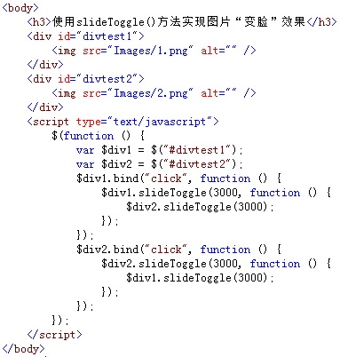
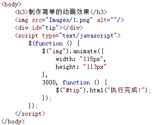
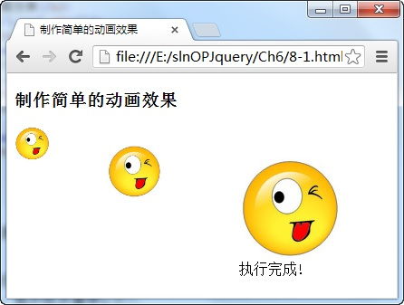
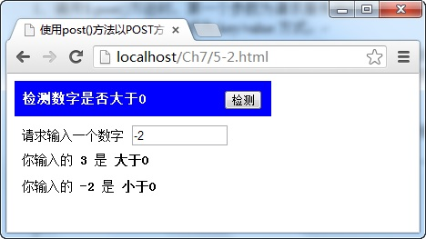
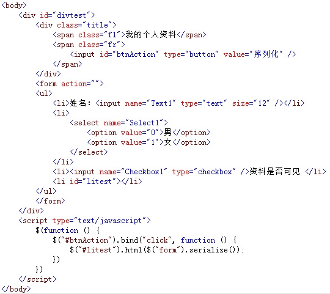

# 动画特效
## 调用show()和hide()方法显示和隐藏元素
show()和hide()方法用于显示或隐藏页面中的元素，它的调用格式分别为：

`$(selector).hide(speed,[callback])和$(selector).show(speed,[callback])`

参数speed设置隐藏或显示时的速度值，可为“slow”、“fast”或毫秒数值，可选项参数callback为隐藏或显示动作执行完成后调用的函数名。

```
    <body>
        <h3>show()和hide()方法动画方式显示和隐藏元素</h3>
        <div>
            <h4>我喜欢吃的水果</h4>
            <input id="hidval"  value="0"/>
        </div>
        
        <script type="text/javascript">
            $(function () {
                $("h4").bind("click", function () {
                    if ($("#hidval").val() == 0) {
                        $("#hidval").hide(100,function(){
                            $("#hidval").val(1);
                        })
                    } else {
                        $("#hidval").show(100,function(){
                            $("#hidval").val(0);
                        })
                    }
                })
            });
        </script>
    </body>
```

## 调用toggle()方法实现动画切换效果
第一节我们学过实现元素的显示与隐藏需要使用hide()与show()，那么有没有更简便的方法来实现同样的动画效果呢？

调用toggle()方法就可以很容易做到，即如果元素处于显示状态，调用该方法则隐藏该元素，反之，则显示该元素，它的调用格式是：

`$(selector).toggle(speed,[callback])`

其中speed参数为动画效果时的速度值，可以为数字，单位为毫秒，也可是“fast”、“slow”字符，可选项参数callback为方法执行成功后回调的函数名称。


```
    <body>
        <h3>toggle()方法的动画切换效果</h3>
        <div>
            <h4>
               <span class="fl">我喜欢吃的水果</span>
               <span class="fr" id="spnTip">显示</span>
            </h4>
        </div>
        
        <script type="text/javascript">
            $(function () {
                var $spn = $("#spnTip");
                $("h4").bind("click", function () {
                    $(".fr").toggle(100,function(){
                     $spn.html() == "隐藏" ? $spn.html("显示") : $spn.html("隐藏");
                    })
                });
            });
        </script>
    </body>
```

点击会 显示、隐藏


## 使用slideUp()和slideDown()方法的滑动效果
可以使用slideUp()和slideDown()方法在页面中滑动元素，前者用于向上滑动元素，后者用于向下滑动元素，它们的调用方法分别为：

`$(selector).slideUp(speed,[callback])和$(selector).slideDown(speed,[callback])`

其中speed参数为滑动时的速度，单位是毫秒，可选项参数callback为滑动成功后执行的回调函数名。

要注意的是：slideDown()仅适用于被隐藏的元素；slideup()则相反。

```
    <body>
        <h3>使用slideUp()和slideDown()方法的滑动效果</h3>
        <div>
            <h4>我喜欢吃的水果</h4>
            <ul>
                <li>苹果</li>
                <li>甘桔</li>
                <li>梨</li>
            </ul>
            <input id="hidval" type="hidden" value="0"/>
        </div>
        
        <script type="text/javascript">
            $(function () {
                $("h4").bind("click", function () {
                    if ($("#hidval").val() == 0) {
                        $("ul").slideDown(100,function() {
                            $("#hidval").val(1);
                        })
                    } else {
                        $("ul").slideUp(100,function() {
                            $("#hidval").val(0);
                        })
                    }
                    
                    $("#hidval").attr("type","");
                })
            });
        </script>
    </body>
```

上述代码，点击 不断收起，放下列表


## 使用slideToggle()方法实现图片“变脸”效果
使用slideToggle()方法可以切换slideUp()和slideDown()，即调用该方法时，如果元素已向上滑动，则元素自动向下滑动，反之，则元素自动向上滑动，格式为：

`$(selector).slideToggle(speed,[callback])`

其中speed参数为动画效果时的速度值，可以为数字，单位为毫秒，也可是“fast”、“slow”字符，可选项参数callback为方法执行成功后回调的函数名称。

例如，在页面中，使用slideToggle()方法实现图片“变脸”效果，如下图所示：



在浏览器中显示的效果：


从图中可以看出，当点击第一张图片时，向上滑动收起该图片，当收起完成时，触发回调函数，调用第二张图片的slideToggle()方法，向下滑动显示第二张图片。

## 使用fadeIn()与fadeOut()方法实现淡入淡出效果
fadeIn()和fadeOut()方法可以实现元素的淡入淡出效果，前者淡入隐藏的元素，后者可以淡出可见的元素，它们的调用格式分别为：

`$(selector).fadeIn(speed,[callback])和$(selector).fadeOut(speed,[callback])`

其中参数speed为淡入淡出的速度，callback参数为完成后执行的回调函数名。


```
    <body>
        <h3>使用fadeIn()与fadeOut()方法实现元素淡入淡出的效果</h3>
        <div>
            <h4>我喜欢吃的水果</h4>
            <ol>
                <li>苹果</li>
                <li>甘桔</li>
                <li>梨</li>
            </ol>
            <input id="hidval" type="hidden" value="0"/>
        </div>
        
        <script type="text/javascript">
            $(function () {
                $("h4").bind("click", function () {
                    if ($("#hidval").val() == 0) {
                        $("ol").fadeIn(1000,function() {
                            $("#hidval").val(1);
                        })
                    } else {
                        $("ol").fadeOut(1000,function() {
                            $("#hidval").val(0);
                        })
                    }
                })
            });
        </script>
    </body>
```

上述例子，点击标题后，列表淡入淡出。


## 使用fadeTo()方法设置淡入淡出效果的不透明度

调用fadeTo()方法，可以将所选择元素的不透明度以淡入淡出的效果调整为指定的值，该方法的调用格式为：

`$(selector).fadeTo(speed,opacity,[callback])`

其中speed参数为效果的速度，opacity参数为指定的不透明值，它的取值范围是0.0~1.0，可选项参数callback为效果完成后，回调的函数名。


```
    <body>
        <h3>使用fadeTo()方法设置淡入淡出效果的不透明度</h3>
        <span class="red"></span><span class="orange"></span><span class="blue"></span>
        
        <script type="text/javascript">
            $(function () {
                $("span").each(function (index) {
                    switch (index) {
                        case 0:
                            $(".red").fadeTo(3000,0.2);
                            break;
                        case 1:
                            $(".orange").fadeTo(3000,0.5);
                            break;
                        case 2:
                            $(".blue").fadeTo(2000,0.5);
                            break;
                    }
                });
            });
        </script>
    </body>
```


## 调用animate()方法制作简单的动画效果
调用animate()方法可以创建自定义动画效果，它的调用格式为：

`$(selector).animate({params},speed,[callback])`

其中，params参数为制作动画效果的CSS属性名与值，speed参数为动画的效果的速度，单位为毫秒，可选项callback参数为动画完成时执行的回调函数名。


例如，调用animate()方法以由小到大的动画效果显示图片，如下图所示：



在浏览器中显示的效果：



从图中可以看出，调用animate()方法，以渐渐放大的动画效果显示图片元素，当动画执行完成后，通过回调函数在页面的`<div>`元素中显示“执行完成!”的字样。


```
    <body>
        <h3>制作移动位置的动画</h3>
        <span></span>
        <div id="tip"></div>
        
        <script type="text/javascript">
            $(function () {
                $("span").animate({
                    left: "+=100px"
                }, 3000, function () {
                    $("span").animate({
                        height: '+=30px',
                        width: '+=30px'
                    }, 3000, function () {
                        $("#tip").html("执行完成!");
                    });
                });
            });
        </script>
    </body>
```
或者如上述代码所示，先左移动100px，然后变大

## 调用stop()方法停止当前所有动画效果
stop()方法的功能是在动画完成之前，停止当前正在执行的动画效果，这些效果包括滑动、淡入淡出和自定义的动画，它的调用格式为：

`$(selector).stop([clearQueue],[goToEnd])`

其中，两个可选项参数clearQueue和goToEnd都是布尔类型值，前者表示是否停止正在执行的动画，后者表示是否完成正在执行的动画，默认为false。

```
        <script type="text/javascript">
            $(function () {
                $("span").animate({
                    left: "+=100px"
                }, 3000, function () {
                    $(this).animate({
                        height: '+=60px',
                        width: '+=60px'
                    }, 3000, function () {
                        $("#tip").html("执行完成!");
                    });
                });
                $("#btnStop").bind("click", function () {
                   $("span").stop();
                    $("#tip").html("执行停止!");
                });
            });
        </script>
```


## 调用delay()方法延时执行动画效果
delay()方法的功能是设置一个延时值来推迟动画效果的执行，它的调用格式为：

`$(selector).delay(duration)`

其中参数duration为延时值，它的单位是毫秒，当超过延时值时，动画继续执行。


```
        <script type="text/javascript">
            $(function () {
                $("span").animate({
                    left: "+=100px"
                }, 3000, function () {
                    $(this).animate({
                        height: '+=60px',
                        width: '+=60px'
                    }, 3000, function () {
                        $("#tip").html("执行完成!");
                    });
                });
                $("#btnStop").bind("click", function () {
                    $("span").delay(5000);
                    $("#tip").html("正在延时!");
                });
            });
        </script>
```

# 实现ajax应用
## 使用load()方法异步请求数据
使用load()方法通过Ajax请求加载服务器中的数据，并把返回的数据放置到指定的元素中，它的调用格式为：

`load(url,[data],[callback])`

参数url为加载服务器地址，可选项data参数为请求时发送的数据，callback参数为数据请求成功后，执行的回调函数。

```
    <body>
        <div id="divtest">
            <div class="title">
                <span class="fl">我最爱吃的水果</span> 
                <span class="fr">
                    <input id="btnShow" type="button" value="加载" />
                </span>
            </div>
            <ul></ul>
        </div>
        
        <script type="text/javascript">
            $(function () {
                $("#btnShow").bind("click", function () {
                    var $this = $(this);
                    $("ul")
                    .load("http://www.imooc.com/data/fruit_part.html",function() {
                        $this.attr("disabled", "true");
                    });
                })
            });
        </script>
    </body>
```

去<http://www.imooc.com/data/fruit_part.html>获取数据，并且把获取的数据插入元素内

## 使用getJSON()方法异步加载JSON格式数据
使用getJSON()方法可以通过Ajax异步请求的方式，获取服务器中的数据，并对获取的数据进行解析，显示在页面中，它的调用格式为：

`jQuery.getJSON(url,[data],[callback])或$.getJSON(url,[data],[callback])`

其中，url参数为请求加载json格式文件的服务器地址，可选项data参数为请求时发送的数据，callback参数为数据请求成功后，执行的回调函数。


```
    <body>
        <div id="divtest">
            <div class="title">
                <span class="fl">我最喜欢的一项运动</span> 
                <span class="fr">
                    <input id="btnShow" type="button" value="加载" />
                </span>
            </div>
            <ul></ul>
        </div>
        
        <script type="text/javascript">
            $(function () {
                $("#btnShow").bind("click", function () {
                    var $this = $(this);
                    $.getJSON("http://www.imooc.com/data/sport.json",function(data){
                        $this.attr("disabled", "true");
                        $.each(data, function (index, sport) {
                            if(index==3)
                            $("ul").append("<li>" + sport["name"] + "</li>");
                        });
    
                    });
                })
            });
        </script>
    </body>
```

从 <http://www.imooc.com/data/sport.json>获取json数据，并且显示第4个。


## 使用getScript()方法异步加载并执行js文件
使用getScript()方法异步请求并执行服务器中的JavaScript格式的文件，它的调用格式如下所示：

`jQuery.getScript(url,[callback])或$.getScript(url,[callback])`

参数url为服务器请求地址，可选项callback参数为请求成功后执行的回调函数。

```
    <body>
        <div id="divtest">
            <div class="title">
                <span class="fl">我最喜欢的运动</span> 
                <span class="fr">
                    <input id="btnShow" type="button" value="加载" />
                </span>
            </div>
            <ul></ul>
        </div>
        
        <script type="text/javascript">
            $(function () {
                $("#btnShow").bind("click", function () {
                    var $this = $(this);
                    $.getScript("http://www.imooc.com/data/sport_f.js",function() {
                        $this.attr("disabled", "true");
                    });
                })
            });
        </script>
    </body>
```

使用getScript()方法加载并执行指定服务器路径  <http://www.imooc.com/data/sport_f.js>   的JavaScript格式文件，根据条件，将数据内容显示在页面中。

## 使用get()方法以GET方式从服务器获取数据
使用get()方法时，采用GET方式向服务器请求数据，并通过方法中回调函数的参数返回请求的数据，它的调用格式如下：

`$.get(url,[callback])`

参数url为服务器请求地址，可选项callback参数为请求成功后执行的回调函数。

```
    <body>
        <div id="divtest">
            <div class="title">
                <span class="fl">我的个人资料</span> 
                <span class="fr">
                    <input id="btnShow" type="button" value="加载" />
                </span>
            </div>
            <ul></ul>
        </div>
        
        <script type="text/javascript">
            $(function () {
                $("#btnShow").bind("click", function () {
                    var $this = $(this);
                    $.get("http://www.imooc.com/data/info_f.php",function(data) {
                        $this.attr("disabled", "true");
                        $("ul").append("<li>我的名字叫：" + data.name + "</li>");
                        $("ul").append("<li>男朋友对我说：" + data.say + "</li>");
                    }, "json");
                })
            });
        </script>
    </body>
```

使用`$.get()`方法，请求服务器中 <http://www.imooc.com/data/info_f.php> 文件中的数据，并将返回的内容显示在页面中。


## 使用post()方法以POST方式从服务器发送数据
与get()方法相比，post()方法多用于以POST方式向服务器发送数据，服务器接收到数据之后，进行处理，并将处理结果返回页面，调用格式如下：

`$.post(url,[data],[callback])`

参数url为服务器请求地址，可选项data为向服务器请求时发送的数据，可选项callback参数为请求成功后执行的回调函数。

```
    <body>
        <div id="divtest">
            <div class="title">
                <span class="fl">检测数字是否大于0</span> 
                <span class="fr"><input id="btnCheck" type="button" value="检测" /></span>
            </div>
            <ul>
               <li>请求输入一个数字 <input id="txtNumber" type="text" size="12" /></li>
            </ul>
        </div>
        
        <script type="text/javascript">
            $(function () {
                $("#btnCheck").bind("click", function () {
                    $.post("http://www.imooc.com/data/check_f.php",{
                        num:$("#txtNumber").val()
                    },
                    function (data) {
                        $("ul").append("<li>你输入的<b>  "
                        + $("#txtNumber").val() + " </b>是<b> "
                        + data + " </b></li>");
                    });
                })
            });
        </script>
    </body>
```

使用`$.post()`向服务器 <http://www.imooc.com/data/check_f.php> 文件中发送检测的数据。

注意：在POST过程中，传递的参数就是用户在文本框中输入的值。




## 使用serialize()方法序列化表单元素值
使用serialize()方法可以将表单中有name属性的元素值进行序列化，生成标准URL编码文本字符串，直接可用于ajax请求，它的调用格式如下：

`$(selector).serialize()`

其中selector参数是一个或多个表单中的元素或表单元素本身。

例如，在表单中添加多个元素，点击“序列化”按钮后，调用serialize()方法，将表单元素序列化后的标准URL编码文本字符串显示在页面中，如下图所示：



在浏览器中显示的效果：


从图中可以看出，当点击“序列化”按钮后，调用表单元素本身的serialize()方法，将表单中元素全部序列化，生成标准URL编码，各元素间通过&号相联。


