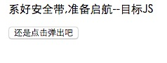
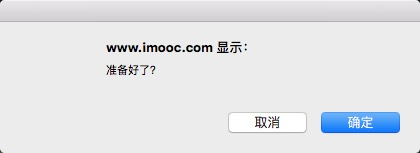
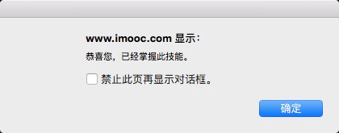
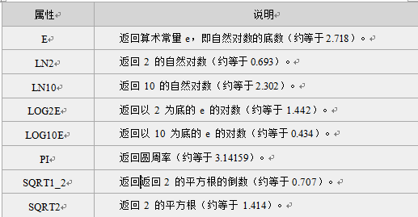
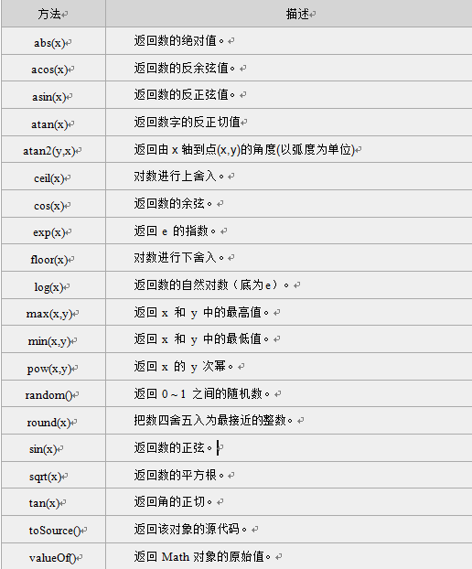
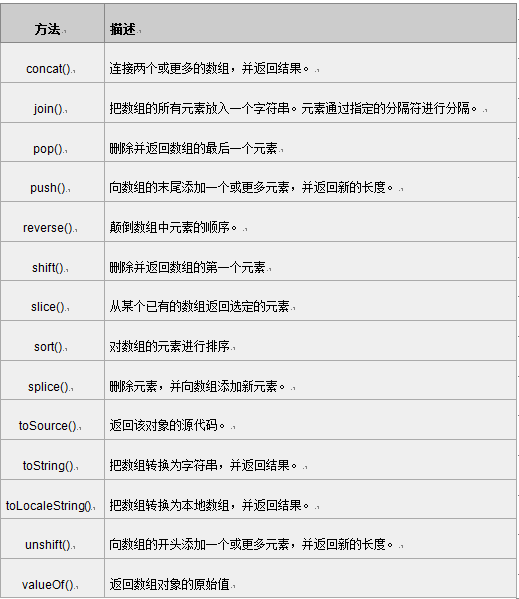

## html引入JS文件

html代码中用 `<script type="text/script" src="script.js"></script>`引入js文件。

例如：

index.html

```
<!DOCTYPE HTML>
<html>
	<head>
		<meta http-equiv="Content-Type" content="text/html; charset=utf-8" />
		<title>系好安全带,准备启航</title>
		<script type="text/script" src="script.js"></script><!--引入外部文件的方式-->
	</head>
	
	<body>
		<button onclick="i.alertWord()">还是点击弹出吧</button>
	</body>
</html>
```

script.js

```
document.write("系好安全带,准备启航--目标JS"+"<br><br>")
//在页面中显示文字

var i={
      alertWord:function(){
          var j=confirm("准备好了？");
          if(j===true){
          	alert("恭喜您，已经掌握此技能。")
          }
          else{
          	alert("请重新学习课程内容吆，直到实践编写代码与实践要求一致!")
          }
      },}

```


运行结果如下







## 数组

### 一维数组

通过多种方式创建数组

```
var myarray=new Array(); //创建一个新的空数组
myarray[0]=66; //存储第1个人的成绩
myarray[1]=80; //存储第2个人的成绩
myarray[2]=90; //存储第3个人的成绩
myarray[3]=77; //存储第4个人的成绩
myarray[4]=59; //存储第5个人的成绩

var myarray= new Array(8); //创建数组，存储8个数据。 

var myarray = new Array(66,80,90,77,59);//创建数组同时赋值

var myarray = [66,80,90,77,59];//直接输入一个数组（称 “字面量数组”）
```

JavaScript数组的length属性是可变的，这一点需要特别注意。可以直接修改数组的长度

```
var arr=[55,32,5,90,60,98,76,54];//包含8个数值的数组arr
arr.length=10; //增大数组的长度
document.write(arr.length); //数组长度已经变为10
```


### 二维数组

```
第一种定义二维数组的方式：
var myarr=new Array();  //先声明一维 
for(var i=0;i<2;i++){   //一维长度为2
   myarr[i]=new Array();  //再声明二维 
   for(var j=0;j<3;j++){   //二维长度为3
   myarr[i][j]=i+j;   // 赋值，每个数组元素的值为i+j
   }
 }
 
 第二种定义二维数组的方式：
 var Myarr = [[0 , 1 , 2 ],[1 , 2 , 3, ]]
```


## 判断、循环
```
if (n == "nihao"){
}
else{
}

for(int i = 0; i < 5; i++){
	if (i == 4){
		break;
	}
}

while(num <= 6){
  num+=1;
}

do
{
}while (num <= 5)

```


## 函数

函数定义：

function  函数名( )
{
     函数体;
}

```
function add2(a,b){
	sum = a + b;
 	alert(sum);
} //  只需写一次就可以

add2(3,2);
add2(7,8);
//只需调用函数就可以
```


函数调用：

第一种情况:在`<script>`标签内调用。

```
  <script type="text/javascript">
    function add2()
    {
         sum = 1 + 1;
         return sum;
    }
  add2();//调用函数，直接写函数名。
</SCRIPT>
```

第二种情况：在HTML文件中调用，如通过点击按钮后调用定义好的函数

```
<html>
	<head>
		<script type="text/javascript">
		   function add2()
		   {
		         sum = 5 + 6;
		         alert(sum);
		   }
		</script>
	</head>
	<body>
		<form>
			<input type="button" value="click it" onclick="add2()">  //按钮,onclick点击事件，直接写函数名
		</form>
	</body>
</html>
```


## 事件
JavaScript 创建动态页面。事件是可以被 JavaScript 侦测到的行为。 网页中的每个元素都可以产生某些可以触发 JavaScript 函数或程序的事件。

比如说，当用户单击按钮或者提交表单数据时，就发生一个鼠标单击（onclick）事件，需要浏览器做出处理，返回给用户一个结果。

|事件|说明|
|----|---|
|onclick|鼠标点击事件|
|onmouseover|鼠标经过事件|
|onmouseout|鼠标移开事件|
|onchange|文本框内容改变事件|
|onselect|文本框内容被选中事件|
|onfocus|光标聚焦|
|onblur|光标离开|
|onload|网页导入|
|onunload|关闭网页|


### 鼠标点击事件

打开一个新的窗口

```
<!DOCTYPE HTML>
<html>
<head>
<meta http-equiv="Content-Type" content="text/html; charset=utf-8" />
<title>单击事件 </title>
<script type="text/javascript">
  function openwin(){
     window.open('http://www.imooc.com','_blank','height=600,width=400,top=100,toolbar=no,left=0,menubar=no,scrollbars=no,status=no');}
</script>
</head>
<body>
  <form>
    <input name="点击我" type="button" value="点击我" onclick="openwin()"/>
  </form>
</body>
</html>
```

`onmouseover`鼠标经过事件 `onmouseout`鼠标移开事件 类似

### 光标失焦事件
下面的例子是：当光标离开输入框的时候触发这个条件

```
<!DOCTYPE HTML>
<html>
<head>
<meta http-equiv="Content-Type" content="text/html; charset=utf-8">
<title> 失焦事件 </title>
<script type="text/javascript">
  function message(){
    alert("请确定已输入密码后，在移开!"); }
</script>    
</head>
<body>
  <form>
   用户:<input name="username" type="text" value="请输入用户名！" >
   密码:<input name="password" type="text" value="请输入密码！" onblur="message()">
  </form>
</body>
</html>
```

聚焦事件类似：onfocus

### 选中事件 
选中文本框中的文字的时候触发

```
<!DOCTYPE HTML>
<html>
<head>
<meta http-equiv="Content-Type" content="text/html; charset=utf-8">
<title> 内容选中事件 </title>
<script type="text/javascript">
  function message(){
    alert("您触发了选中事件！"); }
</script>    
</head>
<body>
  <form>
  个人简介：<br>
   <textarea name="summary" cols="60" rows="5" onselect="message()">请写入个人简介，不少于200字！</textarea>
  </form>
</body>
</html>
```


### 文本框内容改变事件 onchange

```
<!DOCTYPE HTML>
<html>
<head>
<meta http-equiv="Content-Type" content="text/html; charset=utf-8">
<title> 文本框内容改变事件 </title>
<script type="text/javascript">
  function message(){
    alert("您改变了文本内容！"); }
</script>    
</head>
<body>
  <form>
  个人简介：<br>
   <textarea name="summary" cols="60" rows="5">请写入个人简介，不少于200字！</textarea>
  </form>
</body>
</html>
```


### 加载事件 onload
事件会在页面加载完成后，立即发生，同时执行被调用的程序。

注意：

1. 加载页面时，触发`onload`事件，事件写在`<body>`标签内。
2. 此节的加载页面，可理解为打开一个新页面时。

如下代码,当加载一个新页面时，弹出对话框“加载中，请稍等…”。

```
<!DOCTYPE HTML>
<html>
	<head>
		<meta http-equiv="Content-Type" content="text/html; charset=utf-8">
		<title> 加载事件 </title>
		<script type="text/javascript">
		  function message(){
		    alert("加载中，请稍等…"); }
		</script>    
	</head>
	<body onLoad="message()">
	  欢迎学习JavaScript。
	</body>
</html>
```

### 卸载事件（onunload）
当用户退出页面时（页面关闭、页面刷新等），触发onUnload事件，同时执行被调用的程序。

注意：不同浏览器对onunload事件支持不同。

```
<!DOCTYPE HTML>
<html>
	<head>
		<meta http-equiv="Content-Type" content="text/html; charset=utf-8">
		<title> 卸载事件 </title>
		<script type="text/javascript">   
		     window.onunload = onunload_message;   
		     function onunload_message(){   
		        alert("您确定离开该网页吗？");   
		    }   
		</script>   
	</head>
	<body>
	  欢迎学习JavaScript。
	</body>
</html>
```


## 对象
JavaScript 中的所有事物都是对象，如:字符串、数值、数组、函数等，每个对象带有属性和方法。

### 一些内建对象

* Date日期对象

```
var Udate=new Date();  //已有初始值：当前时间(当前电脑系统时间)。

//也可以自定义时间
var d = new Date(2012, 10, 1);  //2012年10月1日
var d = new Date('Oct 1, 2012'); //2012年10月1日
```

常用方法：

```
-> get/setFullYear() 返回/设置年份，用四位数表示

<script type="text/javascript">
var mydate=new Date();//当前时间2014年3月6日
document.write(mydate+"<br>");//输出当前时间
document.write(mydate.getFullYear()+"<br>");//输出当前年份
mydate.setFullYear(81); //设置年份
document.write(mydate+"<br>"); //输出年份被设定为 0081年。
</script>

结果格式依次为：星期、月、日、年、时、分、秒、时区。
---
结果：
Thu Mar 06 2014 10:57:47 GMT+0800
2014
Thu Mar 06 0081 10:57:47 GMT+0800
---

-> etDay() 返回星期，返回的是0-6的数字，0 表示星期天
<script type="text/javascript">
  var mydate=new Date();//定义日期对象
  var weekday=["星期日","星期一","星期二","星期三","星期四","星期五","星期六"];
//定义数组对象,给每个数组项赋值
  var mynum=mydate.getDay();//返回值存储在变量mynum中
  document.write(mydate.getDay());//输出getDay()获取值
  document.write("今天是："+ weekday[mynum]);//输出星期几
</script>


-> get/setTime() 返回/设置时间，单位毫秒数，计算从 1970 年 1 月 1 日零时到日期对象所指的日期的毫秒数。
<script type="text/javascript">
  var mydate=new Date();
  document.write("当前时间："+mydate+"<br>");
  mydate.setTime(mydate.getTime() + 60 * 60 * 1000);
  document.write("推迟一小时时间：" + mydate);
</script>

----
当前时间：Thu Mar 6 11:46:27 UTC+0800 2014

推迟一小时时间：Thu Mar 6 12:46:27 UTC+0800 2014
----


```


* String 字符串对象

```
读取字符：
-> charAt() 函数

<script type="text/javascript">
  var mystr="I love JavaScript!"
  document.write(mystr.charAt(2));
</script>

---
l
---


-> indexOf() 函数

<script type="text/javascript">
  var str="I love JavaScript!"
  document.write(str.indexOf("I") + "<br />");
  document.write(str.indexOf("v") + "<br />");
  document.write(str.indexOf("v",8));
</script>

---
0
4
9
---

-> 字符串分割函数 split().  split() 方法将字符串分割为字符串数组，并返回此数组。

语法：
stringObject.split(separator,limit)

<script type="text/javascript">
	var mystr = "www.imooc.com";
	document.write(mystr.split(".")+"<br>");
	document.write(mystr.split(".", 2)+"<br>");
</script>

---
www,imooc,com
www,imooc
---

-> 提取字符串substring().
语法：
stringObject.substring(starPos,stopPos)

<script type="text/javascript">
  var mystr="I love JavaScript";
  document.write(mystr.substring(7));
  document.write(mystr.substring(2,6));
</script>

---
JavaScript
love
---

-> 提取指定数目的字符substr()
语法：
stringObject.substr(startPos,length)

<script type="text/javascript">
  var mystr="I love JavaScript!";
  document.write(mystr.substr(7));
  document.write(mystr.substr(2,4));
</script>

---
JavaScript!
love
---

```


* Math对象

```
<script type="text/javascript">
  var mypi=Math.PI; 
  var myabs=Math.abs(-15);
  document.write(mypi);
  document.write(myabs);
</script>

---
3.141592653589793
15
---
```

Math对象属性：



Math 对象方法：




* Array 数组对象

数组的定义：

```
1. 定义了一个空数组:

var  数组名= new Array();
2. 定义时指定有n个空元素的数组：

var 数组名 =new Array(n);
3.定义数组的时候，直接初始化数据：

var  数组名 = [<元素1>, <元素2>, <元素3>...];
我们定义myArray数组，并赋值，代码如下：

var myArray = [2, 8, 6]; 
```



数组常用方法

```
-> 选定元素slice()
语法：
arrayObject.slice(start,end)

<script type="text/javascript">
  var myarr = new Array(1,2,3,4,5,6);
  document.write(myarr + "<br>");
  document.write(myarr.slice(2,4) + "<br>");
  document.write(myarr);
</script>

---
1,2,3,4,5,6
3,4
1,2,3,4,5,6
---

-> sort() 数组排序
语法：
myArray.sort(sortMethod);

1.使用sort()将数组进行排序，代码如下：

<script type="text/javascript">
  var myarr1 = new Array("Hello","John","love","JavaScript"); 
  var myarr2 = new Array("80","16","50","6","100","1");
  document.write(myarr1.sort()+"<br>");
  document.write(myarr2.sort());
</script>

运行结果：
----
Hello,JavaScript,John,love
1,100,16,50,6,80
----
注意:上面的代码没有按照数值的大小对数字进行排序。


2.如要实现这一点，就必须使用一个排序函数，代码如下：

<script type="text/javascript">
  function sortNum(a,b) {
  return a - b;
 //升序，如降序，把“a - b”该成“b - a”
}
 var myarr = new Array("80","16","50","6","100","1");
  document.write(myarr + "<br>");
  document.write(myarr.sort(sortNum));
</script>

运行结果：
---
80,16,50,6,100,1
1,6,16,50,80,100
---

```


### 自定义对象

```
function Person(name){
    this.name=name;
    this.fn=function(){
        alert(this.name);
    }
}
    
var person1=new Person('Byron');
    
console.log(person1.constructor==Person);//true
console.log(person1 instanceof Person); //true
```


