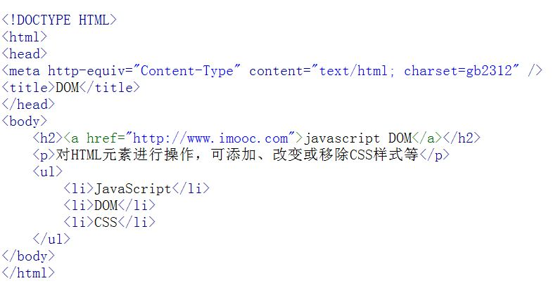
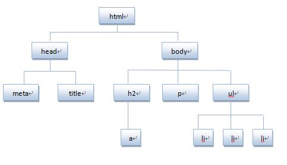
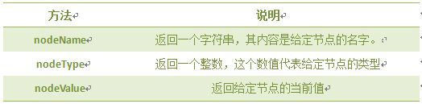
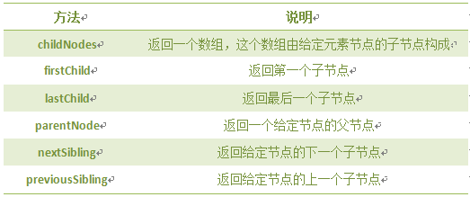
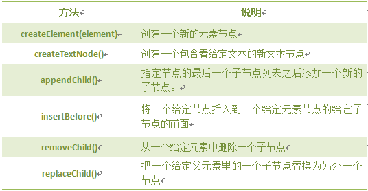

# 浏览器对象
## window 对象


例子： 实现打开一个网页，宽为600，高为400。

```
<body>
	<form>
		<input type="button" value="点击我，打开新窗口" onclick="myFunction()" />
	</form>
	
	<script type="text/javascript">
		function myFunction()
		{
		    alert("欢迎来到慕课网")
		    window.open('http://www.imooc.com','_blank','width=600 height=400')
		}
	</script>
</body>
```

## javaScript 计时器
在JavaScript中，我们可以在设定的时间间隔之后来执行代码，而不是在函数被调用后立即执行。

计时器类型：

一次性计时器：仅在指定的延迟时间之后触发一次。

间隔性触发计时器：每隔一定的时间间隔就触发一次。

计时器方法

|方法|说明|
|---------------|-----------|
|setTimeout()|指定的延迟时间之后来执行代码|
|clearTimeout()|取消setTimeout()设置|
|setInterval()|每隔指定的时间执行代码|
|clearInterval()|取消setInterval()设置|


```
<!DOCTYPE HTML>
<html>
	<head>
		<meta http-equiv="Content-Type" content="text/html; charset=utf-8">
		<title>定时器</title>
		<script type="text/javascript">
		  function clock(){
		    var time=new Date();
		    document.getElementById("clock").value = time;
		  }
		  //每隔100毫秒调用clock函数，并将返回值赋值给i。用于给 clearInterval提供参数清除
		  var int=setInterval(clock, 100)
		  
		</script>
	</head>
	
	<body>
		<form>
			<input type="text" id="clock" size="50"  />
			//点击stop停止计时器
			<input type="button" value="Stop" onclick="clearInterval(i)"  />
		</form>
	</body>
</html>
```

语法：

`setInterval(代码,交互时间);`


## History 对象
history对象记录了用户曾经浏览过的页面(URL)，并可以实现浏览器前进与后退相似导航的功能。

注意:从窗口被打开的那一刻开始记录，每个浏览器窗口、每个标签页乃至每个框架，都有自己的history对象与特定的window对象关联。

`window.history.[属性|方法]`

```

属性：
length  历史访问url数量

方法：
back()     相当于   window.history.go(-1);
forward()  相当于   window.history.go(1);
go()  指定一个数字，返回到那个数字上
```

```
<script type="text/javascript">
  var HL = window.history.length;
  document.write(HL);
</script>
```

## Location 对象
location用于获取或设置窗体的URL，并且可以用于解析URL。

语法：

`location.[属性|方法]`

```
属性：
hash	设置返回从#号开始的URl锚
host 	设置或返回主机名和当前URL的端口号
hostname	设置或返回当前URL的主机名
href	设置或返回完整的url
pathname 设置或返回当前url的路径部分
port	设置或返回当前URL的端口号
protocol	设置或返回当前URL的协议
search	设置或返回从 ？ 开始的url （查询部分）

方法：
assign()	加载新的文档
reload()	重新加载当前文档
replace() 用新的文档替换当前文档

```


## Navigator对象
Navigator 对象包含有关浏览器的信息，通常用于检测浏览器与操作系统的版本。

```
<script type="text/javascript">
   var browser=navigator.appName;
   var b_version=navigator.appVersion;
   var b_platform=navigator.platform;
   var b_userAgent=navigator.userAgent;
</script>
```

## screen对象
screen对象用于获取用户的屏幕信息。

语法：`window.screen.属性`

```
availHeight		窗口可以使用的屏幕高度，单位像素
availWidth		窗口可以使用的屏幕宽度，单位像素
colorDepth		用户浏览器表示的颜色位数，通常为32位
pixelDepth		用户浏览器表示的颜色位数，通常为32位
height				屏幕的高度，单位像素
width				屏幕的宽度，单位像素
```

例子：

```
<script type="text/javascript">
document.write( "屏幕宽度："+screen.width+"px<br />");
document.write( "屏幕高度："+screen.height+"px<br />"); 
document.write("可用宽度：" + screen.availWidth);
document.write("可用高度：" + screen.availHeight);      
</script>
```


## 认识DOM
文档对象模型DOM（Document Object Model）定义访问和处理HTML文档的标准方法。DOM 将HTML文档呈现为带有元素、属性和文本的树结构（节点树）。

先来看看下面代码:



将HTML代码分解为DOM节点层次图:



HTML文档可以说由节点构成的集合，DOM节点有:

1. 元素节点：上图中`<html>、<body>、<p>`等都是元素节点，即标签。

2. 文本节点:向用户展示的内容，如`<li>...</li>`中的JavaScript、DOM、CSS等文本。

3. 属性节点:元素属性，如`<a>`标签的链接属性`href="http://www.imooc.com"`。

节点属性:



遍历节点树:



以上图ul为例，它的父级节点body,它的子节点3个li,它的兄弟结点h2、P。

DOM操作:



注意:前两个是document方法。


