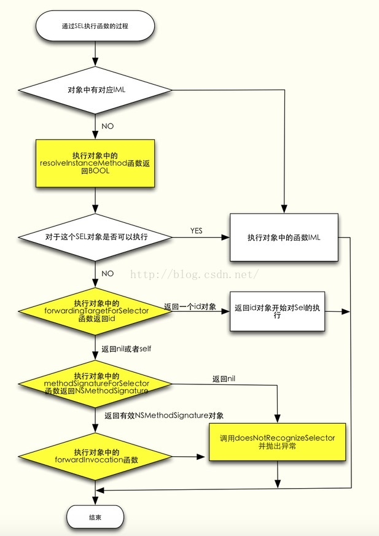

[1]:http://blog.csdn.net/kesalin/article/details/6689226
[2]:http://ios.jobbole.com/81657/
[3]:http://www.cocoachina.com/ios/20130528/6295.html
[4]:http://blog.cnbang.net/tech/2808/
[5]:http://ui.ptlogin2.qq.com/cgi-bin/login?low_login=1&appid=603049403&s_url=http%3A%2F%2Fbugly.qq.com%2Fblog%2F%3Fp%3D64&daid=276
### 参考资料
[1、罗朝辉 深入浅出 Cocoa 之消息][1]
[2、Objective-C 中的元类（meta class）是什么？][2]
[3、小萝莉说crash][5]

## 基本概念与原理
###Class
Class 在objc/objc.h中的定义：

```
typedef struct objc_class *Class;
```
### objc_class的结构
Class 被定义为一个指向 objc_class的结构体指针，这个结构体表示每一个类的类结构。而 objc_class 在objc/objc_class.h中定义如下:

```
struct objc_class {
    struct objc_class * isa; //类指针（类是元类的对象）
    struct objc_class * super_class;  /*父类*/
    const char *name;                 /*类名字*/
    long version;                   /*版本信息*/
    long info;                        /*类信息*/
    long instance_size;               /*实例大小*/
    struct objc_ivar_list *ivars;     /*实例参数链表*/
    struct objc_method_list **methodLists;  /*方法链表*/
    struct objc_cache *cache;               /*方法缓存*/
    struct objc_protocol_list *protocols;   /*协议链表*/
};
```
每个对象都有类。这是面向对象的基本概念，但是在Objective-C中，它对数据结构也一样。含有一个指针且该指针可以正确指向类的数据结构，都可以被视作为对象。
在Objective-C中，对象的类是isa指针决定的。isa指针指向对象所属的类。

### objc_msgSend对这个Class结构的应用：
objc_msgSend方法含有两个必要的参数：receiver、方法名（即：selector），如：

```
		［receiver message］；将被转换为：objc_msgSend(receiver,selector);
```
objc_msgSend方法也能传message的参数，如：

```
    objc_msgSend(receiver, selector, arg1, arg2, …);
```
objc_msgSend调用类方法：

```
    BOOL isSuccess = ((BOOL(*)(id,SEL,int))objc_msgSend)(NSClassFromString(@"MyPointsManager"),NSSelectorFromString(@"addPointsIn:"),50);
```
objc_msgSend调用实例方法：

```
MyPointsManager *pointsManager = [MyPointsManager sharedInstance];
    BOOL isEnabled = ((BOOL(*)(id,SEL))objc_msgSend)(pointsManager,NSSelectorFromString(@"isEnable"));
    NSLog(@"isEnabled %d",isEnabled);
```

#### objc_msgSend调用类方法跟实例方法的调用实现区别：
##### 在oc里，+号函数和-号函数的区别：
-(void)是实例方法，只有定义了这个类的实例，才能用实例调用这个方法。
+(void)是类方法，用类名可以直接调用这个方法。
通过分析，+号函数是基类调用的，-号函数是实例类调用的。其函数结构体数组的位置也不一样。 

##### 1、实例方法调用：
每个对象都有一个指向所属类的指针``isa``。通过该指针，对象可以找到它所属的类，也就找到了其全部父类。当向一个对象发送消息时，objc_msgSend方法根据对象的isa指针找到对象的类，然后在类的``调度表（dispatch table）``中查找selector。如果无法找到selector，objc_msgSend通过指向父类的指针找到父类，并在父类的调度表（dispatch table）中查找selector，以此类推直到NSObject类。一旦查找到selector，``objc_msgSend方法根据调度表的内存地址调用该实现``。 通过这种方式，message与方法的真正实现在执行阶段才绑定。
为了保证消息发送与执行的效率，系统会将全部selector和使用过的方法的内存地址缓存起来。``每个类都有一个独立的缓存，缓存包含有当前类自己的 selector以及继承自父类的selector``。查找调度表（dispatch table）前，消息发送系统首先检查receiver对象的缓存。

##### 2、类方法的调用：
从Class的结构可以看出，Class中也有一个isa指针，指向实现它的类，即[元类（metaClass）][2]。Objective-C中的每个类都有和自己相关的元类，类方法就是放在元类的函数指针数组中。元类也是一个对象，那么元类又指向哪里呢？为了设计上的完整，所有的元类的isa指针都会指向一个根元类。元类的继承关系跟类的继承关系是一样的。

简单说就是：
当你给对象发送消息时，消息是在寻找这个对象的类的方法列表。
当你给类发消息时，消息是在寻找这个类的元类的方法列表。

### objc_class结构里面的方法链表的Method结构
 Method 在头文件 objc_class.h中定义如下：
 
```
typedef struct objc_method *Method;
typedef struct objc_ method {
    SEL method_name;
    char *method_types;
    IMP method_imp;
};
```
一个方法 Method，其包含一个方法选标 SEL – 表示该方法的名称，一个types – 表示该方法参数的类型，一个 IMP  - 指向该方法的具体实现的函数指针

### Method结构中SEL的含义
SEL在objc/objc.h中的定义为：

```
typedef struct objc_selector   *SEL;   
```
它是一个指向 objc_selector 指针，表示方法的名字/签名。
不同的类可以拥有相同的 selector，这个没有问题，因为不同类的实例对象performSelector相同的 selector 时，会在各自的消息选标(selector)/实现地址(address) 方法链表中根据 selector 去查找具体的方法实现IMP, 然后用这个方法实现去执行具体的实现代码。这是一个动态绑定的过程，在编译的时候，我们不知道最终会执行哪一些代码，只有在执行的时候，通过selector去查询，我们才能确定具体的执行代码。

### Method结构中的IMP 的含义
IMP在objc／objc.h中的定义为：
typedef id (*IMP)(id, SEL, ...);

IMP 是一个函数指针，这个被指向的函数包含一个接收消息的对象id(self  指针), 调用方法的选标 SEL (方法名)，以及不定个数的方法参数，并返回一个id。也就是说 IMP 是消息最终调用的执行代码，是方法真正的实现代码 。我们可以像在Ｃ语言里面一样使用这个函数指针。

NSObject 类中的methodForSelector：方法就是这样一个获取指向方法实现IMP 的指针，methodForSelector：返回的指针和赋值的变量类型必须完全一致，包括方法的参数类型和返回值类型。

下面的例子展示了怎么使用指针来调用setFilled:的方法实现：

```
void (*setter)(id, SEL, BOOL);
int i;
setter = (void(*)(id, SEL, BOOL))[target methodForSelector:@selector(setFilled:)];
for (i = 0; i < 1000; i++)
    setter(targetList[i], @selector(setFilled:), YES);
```

### 查找IMP的过程
说objc_class结构的时候说过，objc_msgSend 会根据方法选标 SEL 在类结构的方法列表中查找方法实现IMP。这里头有一些文章，我们在前面的类结构中也看到有一个叫objc_cache *cache 的成员，这个缓存为提高效率而存在的。每个类都有一个独立的缓存，同时包括继承的方法和在该类中定义的方法。。

下面这段是苹果官方的运行时源码

```
static Method look_up_method(Class cls, SEL sel,   
                             BOOL withCache, BOOL withResolver)  
{  
    Method meth = NULL; 
    if (withCache) {  
        meth = _cache_getMethod(cls, sel, &_objc_msgForward_internal);  
        if (meth == (Method)1) {  
            // Cache contains forward:: . Stop searching.  
            return NULL;  
        }  
    }  
    if (!meth) meth = _class_getMethod(cls, sel);  
    if (!meth  &&  withResolver) meth = _class_resolveMethod(cls, sel); 
    return meth;  
}  
```
看上面的源代码可以看出：
1、首先去该类的方法 cache中查找，如果找到了就返回它；
2、如果没有找到，就去该类的方法列表中查找。如果在该类的方法列表中找到了，则将 IMP返回，并将它加入cache中缓存起来。根据最近使用原则，这个方法再次调用的可能性很大，缓存起来可以节省下次调用再次查找的开销。
3、如果在该类的方法列表中没找到对应的 IMP，在通过该类结构中的 super_class指针在其父类结构的方法列表中去查找，直到在某个父类的方法列表中找到对应的IMP，返回它，并加入cache中；
4、如果在自身以及所有父类的方法列表中都没有找到对应的 IMP，则看是不是可以进行动态方法决议；
5、如果动态方法决议没能解决问题，进入下面要讲的消息转发流程。


## 消息转发机制
对象在函数列表中找不到SEL或者找不到SEL对应的IMP实现的时候就会进入消息转发流程。流程如下：



### +(BOOL)resolveInstanceMethod:(SEL)sel  方法拦截消息
这个消息拦截的作用在于给个机会给本对象动态添加需要的selector。
先来看个例子：

Fish类：

```
#import <Foundation/Foundation.h>  
@interface Fish : NSObject  
-(void)fishDescribeYouSelf;  
@end  
  
#import "Fish.h"  
#import <objc/message.h>  
@implementation Fish  
-(void)fishDescribeYouSelf{  
    NSLog(@"I am fish");  
}  
  
-(void)_fishMethodNotExit{  
    NSLog(@"_fishMethodNotExit");  
}  
  
//查找动态指定的IMP  
+(BOOL)resolveInstanceMethod:(SEL)sel{  
      
    if (sel == NSSelectorFromString(@"fishMethodNotExit")) {  
        IMP _fishMethodNotExit = [Fish instanceMethodForSelector:@selector(_fishMethodNotExit)];  
        class_addMethod([self class], sel, _fishMethodNotExit, "v@:");  //v@:  第一个字符代表返回的值是void，@是self的类型id，:是_cmd的类型SEL。（Objective-c中的方法默认被隐藏了两个参数：self指向对象本身,_cmd指向方法本身）。如果是@@:则代表返回值是字符串，f@:代表返回值是浮点型  
        return YES;  
    }  
      
    return [super resolveInstanceMethod:sel];  
}  
@end  
```
调用：

```
Fish *fish = [[Fish alloc] init];  
[fish fishMethodNotExit];  
```

程序不会崩溃并且输出：_fishMethodNotExit。找不到fishMethodNotExit的时候，系统调用了 resolveInstanceMethod，并且给找不到的SEL动态添加了IMP，使得调用_fishMethodNotExit这个函数。


### -(id)forwardingTargetForSelector:(SEL)aSelector 拦截消息并且处理
没有在resolveInstanceMethod实现相关的动态添加，不管返回值是否为YES，消息都会来到快速转发forwardingTargetForSelector。
这个消息拦截的作用在于，给个机会把消息转发给另外一个对象
看例子，新增一个Flower类：

```
#import <Foundation/Foundation.h>  
  
@interface Flower : NSObject  
-(void)fishMethodNotExit;  
@end  
  
@implementation Flower  
-(void)fishMethodNotExit{  
    NSLog(@"fishMethodNotExit in Flower");  
}  
@end  
```
去掉Fish类的resolveInstanceMethod，添加forwardingTargetForSelector的实现。

```
-(id)forwardingTargetForSelector:(SEL)aSelector{  
    Flower *flower = [[Flower alloc] init];  
    if ([flower respondsToSelector:aSelector]) {  
        return flower;  
    }  
      
    return self;  
}  
```

调用：

```
Fish *fish = [[Fish alloc] init];  
[fish fishMethodNotExit];  
```
输出：

```
fishMethodNotExit in Flower
```

### methodSignatureForSelector:   forwardInvocation:
如果resolveInstanceMethod 和 forwardingTargetForSelector没有对消息进行处理，则来到标准转发。methodSignatureForSelector:的作用在于为另一个类实现的消息创建一个有效的方法签名，必须实现，并且返回不为空的methodSignature，否则会crash。forwardInvocation:将选择器转发给一个真正实现了该消息的对象。每一个对象都从NSObject类继承了forwardInvocation:方法，但在NSObject中，该方法只是简单的调用doesNotRecognizeSelector:，通过重写该方法你就可以利用forwardInvocation:将消息转发给其它对象。

```
@interface ForwardClass : NSObject 
-(void)doSomethingElse;
@end

@implementation ForwardClass

-(void)doSomethingElse
 {
    NSLog(@"doSomething was called on %@", [self class]);
}
@end

@interface SomeClass : NSObject 
{
    id forwardClass;
}

-(void)doSomething;

@end

@implementation SomeClass

-(id)init
 {
    if (self = [super init]) {
        forwardClass = [ForwardClass new];
    }
    return self;
}

-(void)doSomething
 {
    NSLog(@"doSomething was called on %@", [self class]);
}

-(void)forwardInvocation:(NSInvocation *)invocation
 {
    if (! forwardClass) {
        [self doesNotRecognizeSelector: [invocation selector]];
    }
    [invocation invokeWithTarget: forwardClass];
}

-(NSMethodSignature*)methodSignatureForSelector:(SEL)selector
 {
    NSMethodSignature *signature = [super methodSignatureForSelector:selector];
    if (! signature) {
        //生成方法签名
        signature = [forwardClass methodSignatureForSelector:selector];
        //[NSMethodSignature signatureWithObjCTypes:"v@:@"]; //也可以这样生成方法签名
    }
    return signature;
}

@end
```
调用：

```
	 id someClass = [SomeClass new];
    [someClass doSomething];//ForwardTest[1291:56187] doSomething was called on SomeClass
    [someClass doSomethingElse];// ForwardTest[1291:56187] doSomething was called on ForwardClass
```


### NSInvocation介绍
在iOS中用Objective-C框架可以直接调用某个对象的消息方式有2种，（另外当然可以直接调用objc_msgSend）
一种是performSelector:withObject: ，再一种就是NSInvocation 。
第一种方式比较简单，能完成简单的调用。但是对于`>2个的参数或者有返回值`的处理，那就需要做些额外工作才能搞定。那么在这种情况下，我们就可以使用NSInvocation来进行这些相对复杂的操作。

```
//方法签名类，需要被调用消息所属的类AsynInvoke ,被调用的消息invokeMethod:
NSMethodSignature *sig= [[AsynInvoke class] instanceMethodSignatureForSelector:@selector(invokeMethod:)];
//根据方法签名创建一个NSInvocation
NSInvocation *invocation=[NSInvocation invocationWithMethodSignature:sig];
//设置调用者也就是AsynInvoked的实例对象，在这里我用self替代
[invocation setTarget:self];
//设置被调用的消息
[invocation setSelector:@selector(invokeMethod:)];
//如果此消息有参数需要传入，那么就需要按照如下方法进行参数设置，需要注意的是，atIndex的下标必须从2开始。原因为：0 1 两个参数已经被target 和selector占用
NSInteger num=10;
[invocation setArgument:&num atIndex:2];
//retain 所有参数，防止参数被释放dealloc
[invocation retainArguments];
//消息调用
[invocation invoke];


//如果调用的消息有返回值，那么可进行以下处理
//获得返回值类型
const char *returnType = sig.methodReturnType;
//声明返回值变量
id returnValue;
//如果没有返回值，也就是消息声明为void，那么returnValue=nil
if( !strcmp(returnType, @encode(void)) ){
	returnValue =  nil;
}
//如果返回值为对象，那么为变量赋值
else if( !strcmp(returnType, @encode(id)) ){
	[invocation getReturnValue:&returnValue];
}
else{
	//如果返回值为普通类型NSInteger  BOOL
	//返回值长度
	NSUInteger length = [sig methodReturnLength];
	//根据长度申请内存
	void *buffer = (void *)malloc(length);
	//为变量赋值
	[invocation getReturnValue:buffer];

	if( !strcmp(returnType, @encode(BOOL)) ) {
		returnValue = [NSNumber numberWithBool:*((BOOL*)buffer)];
	}
		else if( !strcmp(returnType, @encode(NSInteger)) ){
		returnValue = [NSNumber numberWithInteger:*((NSInteger*)buffer)];
	}
	returnValue = [NSValue valueWithBytes:buffer objCType:returnType];
}
```


