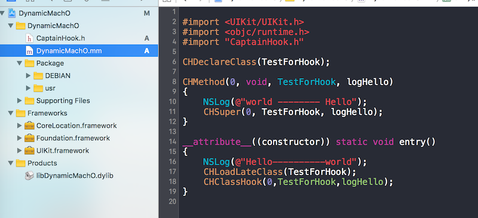
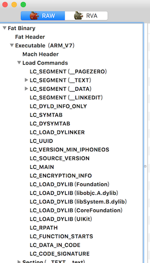
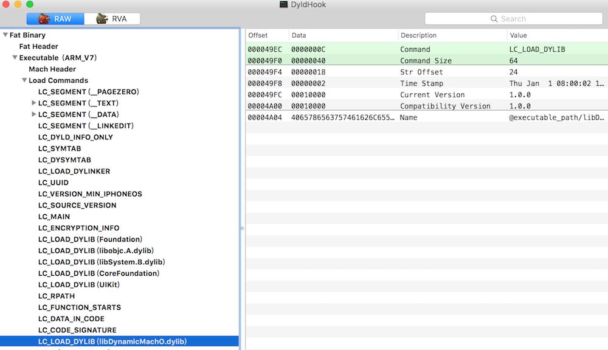

# 原理以及工具
要在非越狱系统上hook，需要注入带有hook功能的动态库。动态库我们可以用iOSOpenDev创建，可以利用Objective-C的runtime特性进行hook。

[yololib](https://github.com/KJCracks/yololib)是Kim Jong Cracks（Clutch 砸壳的作者）小组搞出来的一个dylib注入工具，利用这个工具，大大方便我们修改Mach-O 文件的 Load Command。以达到注入动态库的目的

```
./yololib [binary] [dylib file]
./yololib [被插入dylib的二进制文件] [要插入的dylib]
```

查看Mach-O 的文件结构，可以用一个叫 **MachOView**的软件去分析查看。

整个过程是这样的： 写dylib、给dylib签名、yololib执行命令写信息进Mach-O文件、把签过名的dylib放入.app目录、对.app签名。打包成.ipa，然后就可以了发布安装了。PS：可以把ipa包丢进 fir.im 或者 蒲公英 这样的平台下载。省去自己发布的麻烦。

# 实践

## 创建一个App
这个App主要是为了测试hook。只 创建了一个类 TestForHook

```
#import <Foundation/Foundation.h>

@interface TestForHook : NSObject

- (void)logHello;

@end

#import "TestForHook.h"


@implementation TestForHook

- (void)logHello{
    NSLog(@"Hello!!!!!!!");
}

@end

```

应用启动的时候调用。

```
- (BOOL)application:(UIApplication *)application didFinishLaunchingWithOptions:(NSDictionary *)launchOptions {
    // Override point for customization after application launch.
    NSLog(@"dyld hook");
    TestForHook *test = [TestForHook new];
    [test logHello];
    
    return YES;
}
```

build->把.app包拖进iTunes -> iTunes的应用目录下找到对应的.ipa包

## 创建动态库
用iOSOpenDev创建一个动态库。 iOSOpenDev怎么安装，请自行 Google，略微有点麻烦。 CaptainHook.h 在GitHub上有。搜一下就出来了。里面定义了很多宏。封装了Objective-C runtime的接口。可以比较方便的进行hook。



```

#import <UIKit/UIKit.h>
#import <objc/runtime.h>
#import "CaptainHook.h"

CHDeclareClass(TestForHook);

CHMethod(0, void, TestForHook, logHello)
{
    NSLog(@"world -------- Hello");
    CHSuper(0, TestForHook, logHello);
}

__attribute__((constructor)) static void entry()
{
    NSLog(@"Hello----------world");
    CHLoadLateClass(TestForHook);
    CHClassHook(0,TestForHook,logHello);
}

```

`__attribute__((constructor)) static void entry()` 是动态库构造函数。

CHDeclareClass 声明要Hook的类

CHMethod()这个宏的格式是：参数的个数，返回值的类型，类的名称，selector的名称，参数的类型，selector对应的参数的变量名。

CHLoadLateClass 这个宏的是加载class，里面封装了 objc_getClass

CHClassHook()这个宏的格式是：参数的个数,类的名称，selector的名称。


**build -> 生成动态库  libDynamicMachO.dylib**

## yololib注入
解压出 .ipa包里面的 .app（注意：在mac上，看不到.app后缀。可以在终端上执行一下ls 命令，看文件），把.app、生成的yololib、.dylib放在同一个目录下。执行命令注入

```
./yololib ./DyldHook.app/DyldHook libDynamicMachO.dylib
```

用Mach-O 查看注入结果：

**注入前**



**注入后**



## 签名、打包
准备与证书（已经装在电脑的证书）跟对应证书的 .mobileprovision文件。把.dylib、.app、EntitleMents.plist、.mobileprovision文件放在同一个目录下

EntitleMents.plist文件的内容。 其中  `N629B89TN9.hehele.DyldHook`的 `hehele.DyldHook`是 .app的包名。 `N629B89TN9`是证书的Team ID(Developer.apple.com 后台可以看到)

```
<?xml version="1.0" encoding="UTF-8"?>
<!DOCTYPE plist PUBLIC "-//Apple//DTD PLIST 1.0//EN" "http://www.apple.com/DTDs/PropertyList-1.0.dtd">
<plist version="1.0">
<dict>
	<key>application-identifier</key>
	<string>N629B89TN9.hehele.DyldHook</string>
	<key>get-task-allow</key>
	<true/>
</dict>
</plist>

```

给动态库重签名（注意我这里用的是iPhone Developer: XXXXX 开发证书， 用发布证书也可以）：

```
codesign -f -s "iPhone Developer: Chen Bo (WE5J649Y8C)" libDynamicMachO.dylib
```

把签了名的 .dylib放到 .app文件夹下面。

给.app文件重签名：

```
codesign -f -s "iPhone Developer: Chen Bo (WE5J649Y8C)" --entitlements Entitlements.plist DyldHook.app
```

打包 .ipa  （另外一个方法是把 .app文件放到Payload文件夹下，压缩，改后缀名为.ipa）

```
xcrun -sdk iphoneos PackageApplication -v DyldHook.app -o ~/Desktop/hooked.ipa
```

.ipa就打包出来了。放到 fir.im上下载安装。就可以看到hook的效果了。

